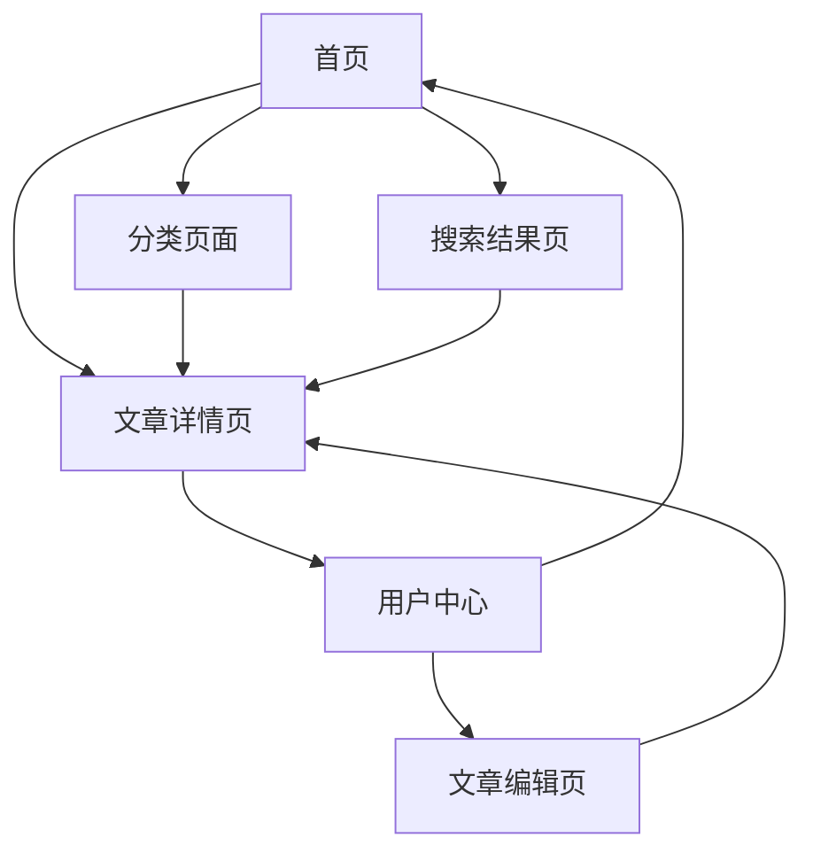

# Planckbaka 技术博客平台 - 产品需求文档

## 1. 产品概述

Planckbaka 技术博客平台是一个基于 React + shadcn/ui + Tailwind CSS 构建的现代化技术博客系统。

该平台旨在为技术写作者提供一个功能丰富、界面美观的内容发布和管理平台，支持响应式设计、AI 辅助功能和现代化的用户体验。

目标是打造一个集内容创作、阅读体验和社区互动于一体的技术博客生态系统。

## 2. 核心功能

### 2.1 用户角色

| 角色 | 注册方式 | 核心权限 |
|------|----------|----------|
| 访客用户 | 无需注册 | 浏览文章、搜索内容、切换主题 |
| 注册用户 | 邮箱注册 | 评论文章、收藏文章、个人资料管理 |
| 作者用户 | 邀请码升级 | 发布文章、编辑内容、查看数据统计 |
| 管理员 | 系统分配 | 用户管理、内容审核、系统配置 |

### 2.2 功能模块

我们的技术博客平台包含以下主要页面：

1. **首页**：导航栏、英雄区块、文章列表、分类标签、搜索框
2. **文章详情页**：文章内容、作者信息、评论系统、相关推荐
3. **文章编辑页**：Markdown 编辑器、实时预览、AI 辅助写作、发布设置
4. **分类页面**：分类导航、标签筛选、文章列表
5. **搜索结果页**：搜索结果展示、AI 智能推荐、筛选器
6. **用户中心**：个人资料、文章管理、数据统计、设置选项

### 2.3 页面详情

| 页面名称 | 模块名称 | 功能描述 |
|----------|----------|----------|
| 首页 | 导航栏 | 响应式导航菜单，包含主要页面链接、用户登录状态、主题切换按钮 |
| 首页 | 英雄区块 | 展示博客标题、简介、最新文章推荐，支持背景图片和动画效果 |
| 首页 | 文章列表 | 分页展示文章卡片，包含标题、摘要、作者、发布时间、标签 |
| 首页 | 搜索功能 | AI 驱动的智能搜索，支持关键词联想和内容推荐 |
| 文章详情页 | 文章内容 | Markdown 渲染、代码高亮、图片优化、目录导航 |
| 文章详情页 | 评论系统 | 用户评论、回复功能、点赞系统、评论管理 |
| 文章详情页 | 相关推荐 | AI 算法推荐相关文章、标签关联、阅读历史 |
| 编辑页面 | Markdown 编辑器 | 实时预览、语法高亮、快捷工具栏、自动保存 |
| 编辑页面 | AI 辅助写作 | 内容建议、语法检查、标题优化、标签推荐 |
| 编辑页面 | 发布设置 | 文章分类、标签设置、发布时间、SEO 优化 |
| 分类页面 | 分类导航 | 树形分类结构、标签云展示、筛选排序功能 |
| 搜索结果页 | 结果展示 | 高亮关键词、相关度排序、多维度筛选 |
| 用户中心 | 个人资料 | 头像上传、基本信息编辑、社交链接管理 |
| 用户中心 | 文章管理 | 草稿管理、发布历史、数据统计、批量操作 |

## 3. 核心流程

**访客用户流程：**
用户访问首页 → 浏览文章列表 → 点击感兴趣的文章 → 阅读文章详情 → 可选择注册账号进行评论或收藏

**注册用户流程：**
登录账号 → 浏览和搜索文章 → 阅读文章并参与评论 → 收藏喜欢的文章 → 管理个人资料

**作者用户流程：**
登录账号 → 进入编辑页面 → 使用 Markdown 编辑器创作 → 利用 AI 辅助功能优化内容 → 设置分类和标签 → 发布文章 → 查看数据统计

## 4. 用户界面设计

### 4.1 设计风格

- **主色调**：深蓝色 (#1e40af) 和浅灰色 (#f8fafc)
- **辅助色**：绿色 (#10b981) 用于成功状态，红色 (#ef4444) 用于警告
- **按钮样式**：圆角设计，支持悬停和点击动画效果
- **字体**：Inter 作为主字体，JetBrains Mono 用于代码显示
- **布局风格**：卡片式设计，顶部导航栏，侧边栏可选
- **图标风格**：使用 Lucide React 图标库，简洁现代

### 4.2 页面设计概览

| 页面名称 | 模块名称 | UI 元素 |
|----------|----------|----------|
| 首页 | 导航栏 | 固定顶部，深色背景，白色文字，响应式汉堡菜单 |
| 首页 | 英雄区块 | 渐变背景，大标题字体 (text-4xl)，居中布局 |
| 首页 | 文章卡片 | 白色背景，阴影效果，圆角边框，悬停动画 |
| 文章详情页 | 内容区域 | 最大宽度 prose，行间距 1.7，代码块深色主题 |
| 编辑页面 | 编辑器 | 分屏布局，左侧编辑右侧预览，工具栏固定顶部 |
| 用户中心 | 侧边栏 | 垂直导航，图标+文字，当前页面高亮显示 |

### 4.3 响应式设计

该产品采用移动优先的响应式设计策略，支持桌面端、平板和手机端的完美适配。针对触摸设备优化了按钮大小和交互体验，确保在各种屏幕尺寸下都能提供良好的用户体验。