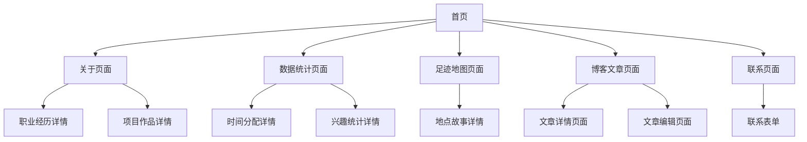

# Planckbaka 个人博客平台 - 产品需求文档

## 1. 产品概述

基于现代简洁设计理念的个人博客平台，融合数据可视化和个人品牌展示功能。平台以故事叙述为核心，通过多维度的数据展示和交互式体验，打造独特的个人数字名片。

* 目标用户：技术从业者、内容创作者、数字游牧者等希望建立个人品牌的专业人士

* 核心价值：通过数据可视化和现代化设计，将个人经历、技能和兴趣以直观且富有吸引力的方式呈现

## 2. 核心功能

### 2.1 用户角色

| 角色   | 注册方式         | 核心权限                 |
| ---- | ------------ | -------------------- |
| 访客用户 | 无需注册         | 浏览所有公开内容、查看统计数据、互动体验 |
| 博主   | 邮箱注册/OAuth登录 | 内容管理、数据更新、个性化配置、访问统计 |

### 2.2 功能模块

我们的个人博客平台包含以下主要页面：

1. **首页**：个人介绍区域、导航菜单、核心亮点展示
2. **关于页面**：详细个人简介、职业经历、技能矩阵、项目作品集
3. **数据统计页面**：多维度数据可视化、时间分配图表、兴趣爱好统计
4. **足迹地图页面**：旅行轨迹展示、地理位置标记、生活足迹
5. **博客文章页面**：技术文章、生活感悟、创作内容
6. **联系页面**：联系方式、社交媒体链接、合作邀请

### 2.3 页面详情

| 页面名称   | 模块名称   | 功能描述                      |
| ------ | ------ | ------------------------- |
| 首页     | Hero区域 | 个人头像、姓名、标语、核心身份标识展示       |
| 首页     | 导航菜单   | 简洁的顶部导航，支持平滑滚动和页面跳转       |
| 首页     | 亮点卡片   | 关键成就、数据概览、特色项目的卡片式展示      |
| 关于页面   | 个人简介   | 详细的个人背景、价值观、兴趣爱好描述        |
| 关于页面   | 职业经历   | 时间轴形式的工作经历、教育背景展示         |
| 关于页面   | 技能矩阵   | 技术栈、专业技能的可视化评级展示          |
| 关于页面   | 项目作品集  | 代表性项目、作品的图文展示和链接          |
| 数据统计页面 | 时间分配图  | 饼图/环形图展示日常时间分配（学习、工作、娱乐等） |
| 数据统计页面 | 兴趣统计   | 电影、音乐、阅读等兴趣爱好的数据可视化       |
| 数据统计页面 | 成长轨迹   | 个人成长数据、里程碑事件的时间线展示        |
| 足迹地图页面 | 交互地图   | 基于地图API的旅行足迹、居住地标记        |
| 足迹地图页面 | 地点故事   | 每个地点的照片、故事、回忆分享           |
| 博客文章页面 | 文章列表   | 分类筛选、标签过滤、搜索功能的文章展示       |
| 博客文章页面 | 文章详情   | Markdown渲染、代码高亮、评论互动      |
| 博客文章页面 | 内容管理   | 文章编辑、发布、草稿管理（博主权限）        |
| 联系页面   | 联系方式   | 邮箱、社交媒体、即时通讯方式展示          |
| 联系页面   | 合作邀请   | 项目合作、演讲邀请、咨询服务的联系表单       |

## 3. 核心流程

### 3.1 访客浏览流程

访客进入首页 → 浏览个人介绍和亮点 → 查看详细的关于页面 → 探索数据统计和足迹地图 → 阅读博客文章 → 通过联系页面建立联系

### 3.2 博主管理流程

博主登录 → 访问管理后台 → 更新个人信息和数据 → 编辑发布博客文章 → 查看访问统计 → 回复评论和消息

## 4. 用户界面设计

### 4.1 设计风格

* **主色调**：深色主题为主（#1a1a1a），辅以现代蓝色（#3b82f6）和温暖橙色（#f59e0b）

* **次要色彩**：中性灰色系列（#6b7280, #9ca3af, #d1d5db）用于文本和背景

* **按钮风格**：圆角矩形按钮，支持悬停动效和渐变背景

* **字体设计**：主标题使用现代无衬线字体（Inter/SF Pro），正文使用易读性强的系统字体

* **布局风格**：极简主义设计，大量留白，卡片式布局，响应式网格系统

* **图标风格**：线性图标为主，配合适当的填充图标，统一的视觉语言

* **动效设计**：微妙的过渡动画，平滑的滚动效果，悬停状态反馈

### 4.2 页面设计概览

| 页面名称   | 模块名称   | UI元素                                  |
| ------ | ------ | ------------------------------------- |
| 首页     | Hero区域 | 全屏背景、居中布局、大号字体标题、副标题、头像（圆形，带阴影）、CTA按钮 |
| 首页     | 导航菜单   | 固定顶部导航、透明背景、悬停效果、移动端汉堡菜单              |
| 首页     | 亮点卡片   | 网格布局、卡片阴影、图标+数字+描述、悬停放大效果             |
| 关于页面   | 个人简介   | 两栏布局、左侧头像和基本信息、右侧详细描述、标签云展示兴趣         |
| 关于页面   | 职业经历   | 垂直时间轴、左右交替布局、公司Logo、职位描述、时间标记         |
| 关于页面   | 技能矩阵   | 技能标签、进度条或星级评分、分类展示（前端、后端、工具等）         |
| 数据统计页面 | 时间分配图  | 交互式饼图、颜色编码、百分比显示、图例说明                 |
| 数据统计页面 | 兴趣统计   | 多种图表类型（柱状图、雷达图）、筛选器、动态数据更新            |
| 足迹地图页面 | 交互地图   | 全屏地图、自定义标记、缩放控制、地点信息弹窗                |
| 博客文章页面 | 文章列表   | 卡片式布局、特色图片、摘要预览、标签展示、分页导航             |
| 博客文章页面 | 文章详情   | 单栏阅读布局、目录导航、代码语法高亮、社交分享按钮             |
| 联系页面   | 联系方式   | 图标+文字组合、社交媒体链接、二维码展示、联系表单             |

### 4.3 响应式设计

* **桌面优先设计**：针对1920px宽屏优化，确保大屏幕下的视觉效果

* **移动端适配**：断点设置为768px和1024px，移动端采用单栏布局

* **触摸优化**：按钮和链接区域不小于44px，支持手势操作

* **性能优化**：图片懒加载、渐进式加载、骨架屏占位

## 5. 特色功能

### 5.1 数据可视化

* **实时数据更新**：连接第三方API（如GitHub、Spotify、Goodreads）自动更新个人数据

* **交互式图表**：支持用户与图表交互，查看详细数据和趋势

* **个性化仪表板**：博主可自定义展示的数据维度和图表类型

### 5.2 内容管理

* **Markdown编辑器**：支持实时预览、语法高亮、图片拖拽上传

* **标签系统**：自动标签建议、标签云展示、相关文章推荐

* **SEO优化**：自动生成meta标签、sitemap、结构化数据

### 5.3 社交互动

* **评论系统**：支持嵌套回复、表情反应、邮件通知

* **分享功能**：一键分享到社交媒体、生成分享卡片

* **订阅功能**：RSS订阅、邮件订阅、新文章通知

### 5.4 个性化体验

* **主题切换**：明暗主题切换、自定义配色方案

* **阅读体验**：字体大小调节、阅读进度指示、估算阅读时间

* **多语言支持**：中英文切换、国际化内容管理

## 6. 技术要求

### 6.1 性能指标

* **首屏加载时间**：< 2秒

* **Lighthouse评分**：性能 > 90分

* **SEO友好**：服务端渲染、语义化HTML

### 6.2 兼容性

* **浏览器支持**：Chrome 90+、Firefox 88+、Safari 14+、Edge 90+

* **设备适配**：桌面端、平板、手机全覆盖

* **无障碍访问**：WCAG 2.1 AA级标准

### 6.3 安全性

* **数据保护**：HTTPS加密、用户数据脱敏

* **内容安全**：XSS防护、CSRF保护

* **隐私合规**：GDPR合规、用户数据控制权

## 7. 项目里程碑

### 7.1 第一阶段（MVP）

* 基础页面搭建（首页、关于、博客）

* 核心功能实现（文章发布、基础统计）

* 响应式设计完成

### 7.2 第二阶段（增强版）

* 数据可视化功能

* 足迹地图集成

* 社交互动功能

### 7.3 第三阶段（完整版）

* 高级个性化功能

* 第三方数据集成

* 性能优化和SEO完善

## 8. 成功指标

* **用户体验**：平均页面停留时间 > 3分钟

* **内容质量**：文章平均阅读完成率 > 60%

* **技术性能**：页面加载速度 < 2秒

* **SEO效果**：搜索引擎收录率 > 95%

* **社交影响**：月度分享次数持续增长

