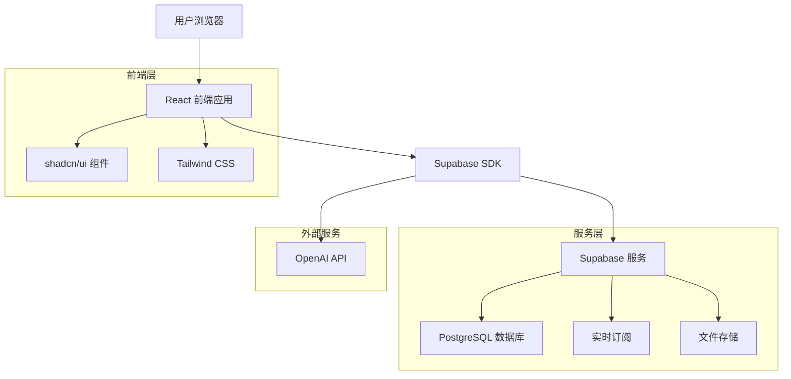
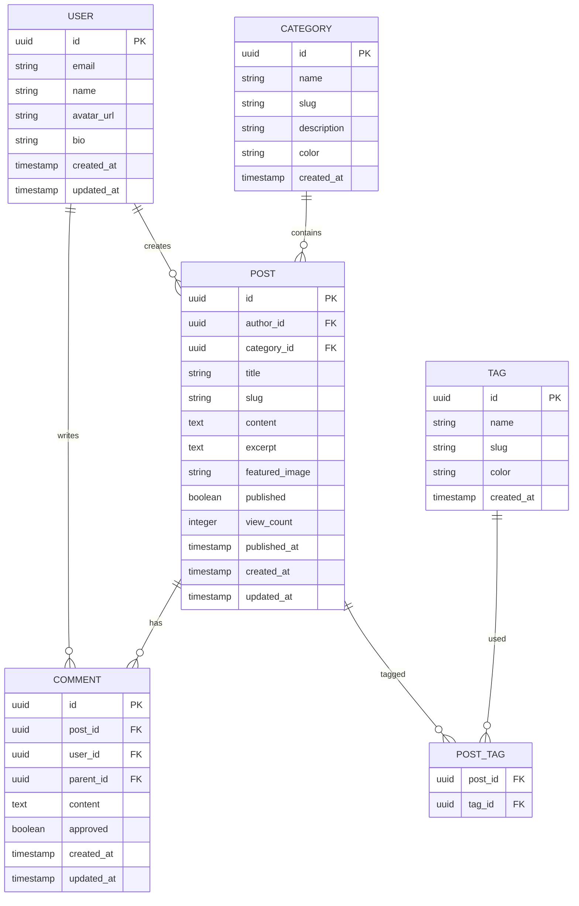

# Planckbaka 技术博客平台 - 技术架构文档

## 1. 架构设计



## 2. 技术描述

### 2.1 推荐方案（Supabase BaaS）

* **前端**: React@18 + TypeScript + Vite + shadcn/ui + Tailwind CSS
* **后端**: Supabase (PostgreSQL + 实时功能 + 认证 + 存储)
* **AI 服务**: OpenAI API (用于内容辅助和搜索优化)
* **部署**: Vercel (前端) + Supabase (后端服务)

### 2.2 备选方案（Go 自建后端）

* **前端**: React@18 + TypeScript + Vite + shadcn/ui + Tailwind CSS
* **后端**: Go + Gin + GORM + PostgreSQL + Redis
* **配置管理**: Viper
* **日志系统**: Zap
* **API 文档**: Swagger
* **测试框架**: Go testing + Testify
* **部署**: Docker + Kubernetes/云服务器
* **AI 服务**: OpenAI API (通过后端代理调用)

## 3. 路由定义

| 路由              | 用途                     |
| --------------- | ---------------------- |
| /               | 首页，展示文章列表和导航           |
| /post/:id       | 文章详情页，显示完整文章内容和评论      |
| /category/:slug | 分类页面，按分类筛选文章           |
| /search         | 搜索结果页，显示搜索结果和AI推荐      |
| /write          | 文章编辑页，Markdown编辑器和发布功能 |
| /edit/:id       | 编辑现有文章                 |
| /profile        | 用户个人资料页面               |
| /dashboard      | 用户仪表板，文章管理和统计          |
| /login          | 用户登录页面                 |
| /register       | 用户注册页面                 |

## 4. API 定义

### 4.1 核心 API

**文章相关接口**

获取文章列表

```
GET /api/posts
```

查询参数:

| 参数名称     | 参数类型   | 是否必需  | 描述         |
| -------- | ------ | ----- | ---------- |
| page     | number | false | 页码，默认为1    |
| limit    | number | false | 每页数量，默认为10 |
| category | string | false | 分类筛选       |
| tag      | string | false | 标签筛选       |

响应:

| 字段名称    | 字段类型    | 描述    |
| ------- | ------- | ----- |
| data    | Post\[] | 文章列表  |
| total   | number  | 总数量   |
| hasMore | boolean | 是否有更多 |

**AI 辅助接口**

```
POST /api/ai/suggest
```

请求:

| 参数名称    | 参数类型   | 是否必需 | 描述                        |
| ------- | ------ | ---- | ------------------------- |
| content | string | true | 文章内容                      |
| type    | string | true | 建议类型 (title/tags/content) |

响应:

| 字段名称        | 字段类型      | 描述     |
| ----------- | --------- | ------ |
| suggestions | string\[] | AI建议列表 |
| confidence  | number    | 置信度    |

示例

```json
{
  "content": "这是一篇关于React Hooks的技术文章...",
  "type": "tags"
}
```

## 5. 数据模型

### 5.1 数据模型定义



### 5.2 数据定义语言

**用户表 (users)**

```sql
-- 创建用户表
CREATE TABLE users (
    id UUID PRIMARY KEY DEFAULT gen_random_uuid(),
    email VARCHAR(255) UNIQUE NOT NULL,
    name VARCHAR(100) NOT NULL,
    avatar_url TEXT,
    bio TEXT,
    role VARCHAR(20) DEFAULT 'user' CHECK (role IN ('user', 'author', 'admin')),
    created_at TIMESTAMP WITH TIME ZONE DEFAULT NOW(),
    updated_at TIMESTAMP WITH TIME ZONE DEFAULT NOW()
);

-- 创建索引
CREATE INDEX idx_users_email ON users(email);
CREATE INDEX idx_users_role ON users(role);
```

**分类表 (categories)**

```sql
-- 创建分类表
CREATE TABLE categories (
    id UUID PRIMARY KEY DEFAULT gen_random_uuid(),
    name VARCHAR(100) NOT NULL,
    slug VARCHAR(100) UNIQUE NOT NULL,
    description TEXT,
    color VARCHAR(7) DEFAULT '#3b82f6',
    created_at TIMESTAMP WITH TIME ZONE DEFAULT NOW()
);

-- 创建索引
CREATE INDEX idx_categories_slug ON categories(slug);

-- 初始化数据
INSERT INTO categories (name, slug, description, color) VALUES
('前端开发', 'frontend', '前端技术相关文章', '#3b82f6'),
('后端开发', 'backend', '后端技术相关文章', '#10b981'),
('人工智能', 'ai', 'AI和机器学习相关文章', '#8b5cf6'),
('开发工具', 'tools', '开发工具和效率相关文章', '#f59e0b');
```

**标签表 (tags)**

```sql
-- 创建标签表
CREATE TABLE tags (
    id UUID PRIMARY KEY DEFAULT gen_random_uuid(),
    name VARCHAR(50) NOT NULL,
    slug VARCHAR(50) UNIQUE NOT NULL,
    color VARCHAR(7) DEFAULT '#6b7280',
    created_at TIMESTAMP WITH TIME ZONE DEFAULT NOW()
);

-- 创建索引
CREATE INDEX idx_tags_slug ON tags(slug);

-- 初始化数据
INSERT INTO tags (name, slug, color) VALUES
('React', 'react', '#61dafb'),
('TypeScript', 'typescript', '#3178c6'),
('Node.js', 'nodejs', '#339933'),
('Python', 'python', '#3776ab');
```

**文章表 (posts)**

```sql
-- 创建文章表
CREATE TABLE posts (
    id UUID PRIMARY KEY DEFAULT gen_random_uuid(),
    author_id UUID NOT NULL REFERENCES users(id) ON DELETE CASCADE,
    category_id UUID REFERENCES categories(id) ON DELETE SET NULL,
    title VARCHAR(200) NOT NULL,
    slug VARCHAR(200) UNIQUE NOT NULL,
    content TEXT NOT NULL,
    excerpt TEXT,
    featured_image TEXT,
    published BOOLEAN DEFAULT false,
    view_count INTEGER DEFAULT 0,
    published_at TIMESTAMP WITH TIME ZONE,
    created_at TIMESTAMP WITH TIME ZONE DEFAULT NOW(),
    updated_at TIMESTAMP WITH TIME ZONE DEFAULT NOW()
);

-- 创建索引
CREATE INDEX idx_posts_author_id ON posts(author_id);
CREATE INDEX idx_posts_category_id ON posts(category_id);
CREATE INDEX idx_posts_published ON posts(published);
CREATE INDEX idx_posts_published_at ON posts(published_at DESC);
CREATE INDEX idx_posts_slug ON posts(slug);
```

**文章标签关联表 (post\_tags)**

```sql
-- 创建文章标签关联表
CREATE TABLE post_tags (
    post_id UUID NOT NULL REFERENCES posts(id) ON DELETE CASCADE,
    tag_id UUID NOT NULL REFERENCES tags(id) ON DELETE CASCADE,
    PRIMARY KEY (post_id, tag_id)
);

-- 创建索引
CREATE INDEX idx_post_tags_post_id ON post_tags(post_id);
CREATE INDEX idx_post_tags_tag_id ON post_tags(tag_id);
```

**评论表 (comments)**

```sql
-- 创建评论表
CREATE TABLE comments (
    id UUID PRIMARY KEY DEFAULT gen_random_uuid(),
    post_id UUID NOT NULL REFERENCES posts(id) ON DELETE CASCADE,
    user_id UUID NOT NULL REFERENCES users(id) ON DELETE CASCADE,
    parent_id UUID REFERENCES comments(id) ON DELETE CASCADE,
    content TEXT NOT NULL,
    approved BOOLEAN DEFAULT true,
    created_at TIMESTAMP WITH TIME ZONE DEFAULT NOW(),
    updated_at TIMESTAMP WITH TIME ZONE DEFAULT NOW()
);

-- 创建索引
CREATE INDEX idx_comments_post_id ON comments(post_id);
CREATE INDEX idx_comments_user_id ON comments(user_id);
CREATE INDEX idx_comments_parent_id ON comments(parent_id);
CREATE INDEX idx_comments_created_at ON comments(created_at DESC);
```

**权限设置**

```sql
-- 为匿名用户授予基本读取权限
GRANT SELECT ON categories TO anon;
GRANT SELECT ON tags TO anon;
GRANT SELECT ON posts TO anon;
GRANT SELECT ON post_tags TO anon;
GRANT SELECT ON comments TO anon;
GRANT SELECT ON users TO anon;

-- 为认证用户授予完整权限
GRANT ALL PRIVILEGES ON categories TO authenticated;
GRANT ALL PRIVILEGES ON tags TO authenticated;
GRANT ALL PRIVILEGES ON posts TO authenticated;
GRANT ALL PRIVILEGES ON post_tags TO authenticated;
GRANT ALL PRIVILEGES ON comments TO authenticated;
GRANT ALL PRIVILEGES ON users TO authenticated;
```

