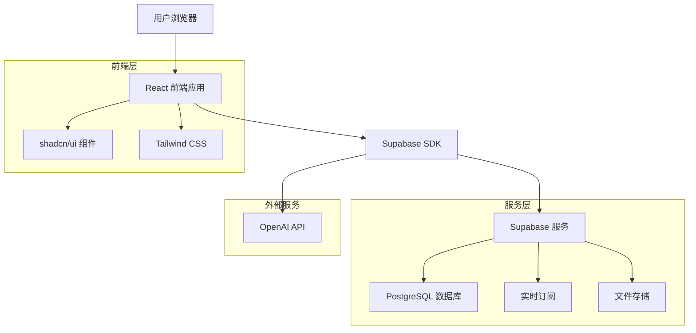
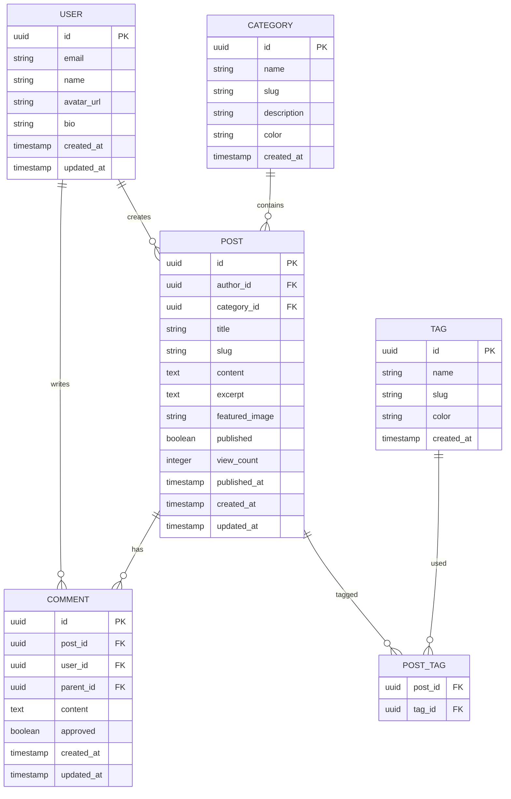

# Planckbaka 技术博客平台 - 技术架构文档

## 1. 架构设计



## 2. 技术描述

### 2.1 推荐方案（Supabase BaaS）

* **前端**: Next.js\@14 + React\@18 + TypeScript + shadcn/ui + Tailwind CSS

* **后端**: Supabase (PostgreSQL + 实时功能 + 认证 + 存储)

* **AI 服务**: OpenAI API (用于内容辅助和搜索优化)

* **部署**: Vercel (前端) + Supabase (后端服务)

### 2.2 备选方案（Go 自建后端）

* **前端**: React\@18 + TypeScript + Vite + shadcn/ui + Tailwind CSS

* **后端**: Go + Gin + GORM + PostgreSQL + Redis

* **配置管理**: Viper

* **日志系统**: Zap

* **API 文档**: Swagger

* **测试框架**: Go testing + Testify

* **部署**: Docker + Kubernetes/云服务器

* **AI 服务**: OpenAI API (通过后端代理调用)

## 3. 路由定义

| 路由              | 用途                     |
| --------------- | ---------------------- |
| /               | 首页，展示文章列表和导航           |
| /post/:id       | 文章详情页，显示完整文章内容和评论      |
| /category/:slug | 分类页面，按分类筛选文章           |
| /search         | 搜索结果页，显示搜索结果和AI推荐      |
| /write          | 文章编辑页，Markdown编辑器和发布功能 |
| /edit/:id       | 编辑现有文章                 |
| /profile        | 用户个人资料页面               |
| /dashboard      | 用户仪表板，文章管理和统计          |
| /login          | 用户登录页面                 |
| /register       | 用户注册页面                 |

## 4. API 定义

### 4.1 核心 API

**文章相关接口**

获取文章列表

```
GET /api/posts
```

查询参数:

| 参数名称     | 参数类型   | 是否必需  | 描述         |
| -------- | ------ | ----- | ---------- |
| page     | number | false | 页码，默认为1    |
| limit    | number | false | 每页数量，默认为10 |
| category | string | false | 分类筛选       |
| tag      | string | false | 标签筛选       |

响应:

| 字段名称    | 字段类型    | 描述    |
| ------- | ------- | ----- |
| data    | Post\[] | 文章列表  |
| total   | number  | 总数量   |
| hasMore | boolean | 是否有更多 |

**AI 辅助接口**

```
POST /api/ai/suggest
```

请求:

| 参数名称    | 参数类型   | 是否必需 | 描述                        |
| ------- | ------ | ---- | ------------------------- |
| content | string | true | 文章内容                      |
| type    | string | true | 建议类型 (title/tags/content) |

响应:

| 字段名称        | 字段类型      | 描述     |
| ----------- | --------- | ------ |
| suggestions | string\[] | AI建议列表 |
| confidence  | number    | 置信度    |

示例

```json
{
  "content": "这是一篇关于React Hooks的技术文章...",
  "type": "tags"
}
```

## 5. 数据模型

### 5.1 数据模型定义



### 5.2 数据定义语言

**用户表 (users)**

```sql
-- 创建用户表
CREATE TABLE users (
    id UUID PRIMARY KEY DEFAULT gen_random_uuid(),
    email VARCHAR(255) UNIQUE NOT NULL,
    name VARCHAR(100) NOT NULL,
    avatar_url TEXT,
    bio TEXT,
    role VARCHAR(20) DEFAULT 'user' CHECK (role IN ('user', 'author', 'admin')),
    created_at TIMESTAMP WITH TIME ZONE DEFAULT NOW(),
    updated_at TIMESTAMP WITH TIME ZONE DEFAULT NOW()
);

-- 创建索引
CREATE INDEX idx_users_email ON users(email);
CREATE INDEX idx_users_role ON users(role);
```

**分类表 (categories)**

```sql
-- 创建分类表
CREATE TABLE categories (
    id UUID PRIMARY KEY DEFAULT gen_random_uuid(),
    name VARCHAR(100) NOT NULL,
    slug VARCHAR(100) UNIQUE NOT NULL,
    description TEXT,
    color VARCHAR(7) DEFAULT '#3b82f6',
    created_at TIMESTAMP WITH TIME ZONE DEFAULT NOW()
);

-- 创建索引
CREATE INDEX idx_categories_slug ON categories(slug);

-- 初始化数据
INSERT INTO categories (name, slug, description, color) VALUES
('前端开发', 'frontend', '前端技术相关文章', '#3b82f6'),
('后端开发', 'backend', '后端技术相关文章', '#10b981'),
('人工智能', 'ai', 'AI和机器学习相关文章', '#8b5cf6'),
('开发工具', 'tools', '开发工具和效率相关文章', '#f59e0b');
```

**标签表 (tags)**

```sql
-- 创建标签表
CREATE TABLE tags (
    id UUID PRIMARY KEY DEFAULT gen_random_uuid(),
    name VARCHAR(50) NOT NULL,
    slug VARCHAR(50) UNIQUE NOT NULL,
    color VARCHAR(7) DEFAULT '#6b7280',
    created_at TIMESTAMP WITH TIME ZONE DEFAULT NOW()
);

-- 创建索引
CREATE INDEX idx_tags_slug ON tags(slug);

-- 初始化数据
INSERT INTO tags (name, slug, color) VALUES
('React', 'react', '#61dafb'),
('TypeScript', 'typescript', '#3178c6'),
('Node.js', 'nodejs', '#339933'),
('Python', 'python', '#3776ab');
```

**文章表 (posts)**

```sql
-- 创建文章表
CREATE TABLE posts (
    id UUID PRIMARY KEY DEFAULT gen_random_uuid(),
    author_id UUID NOT NULL REFERENCES users(id) ON DELETE CASCADE,
    category_id UUID REFERENCES categories(id) ON DELETE SET NULL,
    title VARCHAR(200) NOT NULL,
    slug VARCHAR(200) UNIQUE NOT NULL,
    content TEXT NOT NULL,
    excerpt TEXT,
    featured_image TEXT,
    published BOOLEAN DEFAULT false,
    view_count INTEGER DEFAULT 0,
    published_at TIMESTAMP WITH TIME ZONE,
    created_at TIMESTAMP WITH TIME ZONE DEFAULT NOW(),
    updated_at TIMESTAMP WITH TIME ZONE DEFAULT NOW()
);

-- 创建索引
CREATE INDEX idx_posts_author_id ON posts(author_id);
CREATE INDEX idx_posts_category_id ON posts(category_id);
CREATE INDEX idx_posts_published ON posts(published);
CREATE INDEX idx_posts_published_at ON posts(published_at DESC);
CREATE INDEX idx_posts_slug ON posts(slug);
```

**文章标签关联表 (post\_tags)**

```sql
-- 创建文章标签关联表
CREATE TABLE post_tags (
    post_id UUID NOT NULL REFERENCES posts(id) ON DELETE CASCADE,
    tag_id UUID NOT NULL REFERENCES tags(id) ON DELETE CASCADE,
    PRIMARY KEY (post_id, tag_id)
);

-- 创建索引
CREATE INDEX idx_post_tags_post_id ON post_tags(post_id);
CREATE INDEX idx_post_tags_tag_id ON post_tags(tag_id);
```

**评论表 (comments)**

```sql
-- 创建评论表
CREATE TABLE comments (
    id UUID PRIMARY KEY DEFAULT gen_random_uuid(),
    post_id UUID NOT NULL REFERENCES posts(id) ON DELETE CASCADE,
    user_id UUID NOT NULL REFERENCES users(id) ON DELETE CASCADE,
    parent_id UUID REFERENCES comments(id) ON DELETE CASCADE,
    content TEXT NOT NULL,
    approved BOOLEAN DEFAULT true,
    created_at TIMESTAMP WITH TIME ZONE DEFAULT NOW(),
    updated_at TIMESTAMP WITH TIME ZONE DEFAULT NOW()
);

-- 创建索引
CREATE INDEX idx_comments_post_id ON comments(post_id);
CREATE INDEX idx_comments_user_id ON comments(user_id);
CREATE INDEX idx_comments_parent_id ON comments(parent_id);
CREATE INDEX idx_comments_created_at ON comments(created_at DESC);
```

**权限设置**

```sql
-- 为匿名用户授予基本读取权限
GRANT SELECT ON categories TO anon;
GRANT SELECT ON tags TO anon;
GRANT SELECT ON posts TO anon;
GRANT SELECT ON post_tags TO anon;
GRANT SELECT ON comments TO anon;
GRANT SELECT ON users TO anon;

-- 为认证用户授予完整权限
GRANT ALL PRIVILEGES ON categories TO authenticated;
GRANT ALL PRIVILEGES ON tags TO authenticated;
GRANT ALL PRIVILEGES ON posts TO authenticated;
GRANT ALL PRIVILEGES ON post_tags TO authenticated;
GRANT ALL PRIVILEGES ON comments TO authenticated;
GRANT ALL PRIVILEGES ON users TO authenticated;
```

## 6. Supabase 后端服务集成方案

### 6.1 Supabase SDK 集成步骤

**1. 安装依赖**

```bash
npm install @supabase/supabase-js
npm install @supabase/auth-helpers-nextjs
npm install @supabase/auth-ui-react
npm install @supabase/auth-ui-shared
```

**2. 环境变量配置**

创建 `.env.local` 文件：

```env
NEXT_PUBLIC_SUPABASE_URL=your_supabase_project_url
NEXT_PUBLIC_SUPABASE_ANON_KEY=your_supabase_anon_key
SUPABASE_SERVICE_ROLE_KEY=your_service_role_key
```

**3. Supabase 客户端初始化**

创建 `lib/supabase.ts`：

```typescript
import { createClient } from '@supabase/supabase-js'
import { Database } from '@/types/database'

const supabaseUrl = process.env.NEXT_PUBLIC_SUPABASE_URL!
const supabaseAnonKey = process.env.NEXT_PUBLIC_SUPABASE_ANON_KEY!

export const supabase = createClient<Database>(supabaseUrl, supabaseAnonKey)

// 服务端客户端（用于服务端操作）
export const supabaseAdmin = createClient<Database>(
  supabaseUrl,
  process.env.SUPABASE_SERVICE_ROLE_KEY!,
  {
    auth: {
      autoRefreshToken: false,
      persistSession: false
    }
  }
)
```

**4. Next.js 中间件配置**

创建 `middleware.ts`：

```typescript
import { createMiddlewareClient } from '@supabase/auth-helpers-nextjs'
import { NextResponse } from 'next/server'
import type { NextRequest } from 'next/server'

export async function middleware(req: NextRequest) {
  const res = NextResponse.next()
  const supabase = createMiddlewareClient({ req, res })
  
  const {
    data: { session },
  } = await supabase.auth.getSession()

  // 保护需要认证的路由
  if (req.nextUrl.pathname.startsWith('/dashboard') && !session) {
    return NextResponse.redirect(new URL('/login', req.url))
  }

  if (req.nextUrl.pathname.startsWith('/write') && !session) {
    return NextResponse.redirect(new URL('/login', req.url))
  }

  return res
}

export const config = {
  matcher: ['/dashboard/:path*', '/write/:path*']
}
```

### 6.2 认证流程配置

**1. 认证提供者配置**

在 Supabase Dashboard 中配置认证提供者：

- Email/Password 认证
- Google OAuth
- GitHub OAuth
- Magic Link 认证

**2. 认证组件实现**

创建 `components/auth/AuthForm.tsx`：

```typescript
'use client'

import { useState } from 'react'
import { createClientComponentClient } from '@supabase/auth-helpers-nextjs'
import { Auth } from '@supabase/auth-ui-react'
import { ThemeSupa } from '@supabase/auth-ui-shared'
import { useRouter } from 'next/navigation'

export default function AuthForm() {
  const router = useRouter()
  const supabase = createClientComponentClient()
  const [loading, setLoading] = useState(false)

  const handleSignUp = async (email: string, password: string) => {
    setLoading(true)
    const { error } = await supabase.auth.signUp({
      email,
      password,
      options: {
        emailRedirectTo: `${location.origin}/auth/callback`
      }
    })
    
    if (error) {
      console.error('Error:', error.message)
    } else {
      router.push('/dashboard')
    }
    setLoading(false)
  }

  return (
    <div className="max-w-md mx-auto">
      <Auth
        supabaseClient={supabase}
        view="magic_link"
        appearance={{
          theme: ThemeSupa,
          variables: {
            default: {
              colors: {
                brand: '#404040',
                brandAccent: '#52525b'
              }
            }
          }
        }}
        providers={['google', 'github']}
        redirectTo={`${location.origin}/auth/callback`}
      />
    </div>
  )
}
```

**3. 认证回调处理**

创建 `app/auth/callback/route.ts`：

```typescript
import { createRouteHandlerClient } from '@supabase/auth-helpers-nextjs'
import { cookies } from 'next/headers'
import { NextResponse } from 'next/server'

export async function GET(request: Request) {
  const requestUrl = new URL(request.url)
  const code = requestUrl.searchParams.get('code')

  if (code) {
    const supabase = createRouteHandlerClient({ cookies })
    await supabase.auth.exchangeCodeForSession(code)
  }

  return NextResponse.redirect(requestUrl.origin)
}
```

### 6.3 实时数据订阅实现

**1. 实时评论订阅**

创建 `hooks/useRealtimeComments.ts`：

```typescript
import { useEffect, useState } from 'react'
import { createClientComponentClient } from '@supabase/auth-helpers-nextjs'
import type { Database } from '@/types/database'

type Comment = Database['public']['Tables']['comments']['Row']

export function useRealtimeComments(postId: string) {
  const [comments, setComments] = useState<Comment[]>([])
  const supabase = createClientComponentClient<Database>()

  useEffect(() => {
    // 获取初始评论
    const fetchComments = async () => {
      const { data } = await supabase
        .from('comments')
        .select('*')
        .eq('post_id', postId)
        .order('created_at', { ascending: true })
      
      if (data) setComments(data)
    }

    fetchComments()

    // 订阅实时更新
    const channel = supabase
      .channel('comments')
      .on(
        'postgres_changes',
        {
          event: 'INSERT',
          schema: 'public',
          table: 'comments',
          filter: `post_id=eq.${postId}`
        },
        (payload) => {
          setComments(current => [...current, payload.new as Comment])
        }
      )
      .on(
        'postgres_changes',
        {
          event: 'UPDATE',
          schema: 'public',
          table: 'comments',
          filter: `post_id=eq.${postId}`
        },
        (payload) => {
          setComments(current => 
            current.map(comment => 
              comment.id === payload.new.id ? payload.new as Comment : comment
            )
          )
        }
      )
      .on(
        'postgres_changes',
        {
          event: 'DELETE',
          schema: 'public',
          table: 'comments',
          filter: `post_id=eq.${postId}`
        },
        (payload) => {
          setComments(current => 
            current.filter(comment => comment.id !== payload.old.id)
          )
        }
      )
      .subscribe()

    return () => {
      supabase.removeChannel(channel)
    }
  }, [postId, supabase])

  return comments
}
```

**2. 实时文章浏览量更新**

创建 `hooks/useRealtimeViews.ts`：

```typescript
import { useEffect } from 'react'
import { createClientComponentClient } from '@supabase/auth-helpers-nextjs'

export function useRealtimeViews(postId: string) {
  const supabase = createClientComponentClient()

  useEffect(() => {
    // 增加浏览量
    const incrementViews = async () => {
      await supabase.rpc('increment_post_views', { post_id: postId })
    }

    incrementViews()

    // 订阅浏览量变化
    const channel = supabase
      .channel('post_views')
      .on(
        'postgres_changes',
        {
          event: 'UPDATE',
          schema: 'public',
          table: 'posts',
          filter: `id=eq.${postId}`
        },
        (payload) => {
          // 处理浏览量更新
          console.log('Views updated:', payload.new.view_count)
        }
      )
      .subscribe()

    return () => {
      supabase.removeChannel(channel)
    }
  }, [postId, supabase])
 }
 ```

## 7. API 接口设计规范

### 7.1 RESTful API 端点规划

**文章管理 API**

```typescript
// 获取文章列表
GET /api/posts
// 查询参数: page, limit, category, tag, search

// 获取单篇文章
GET /api/posts/[slug]

// 创建文章（需要认证）
POST /api/posts

// 更新文章（需要认证且为作者）
PUT /api/posts/[id]

// 删除文章（需要认证且为作者）
DELETE /api/posts/[id]

// 发布/取消发布文章
PATCH /api/posts/[id]/publish
```

**评论管理 API**

```typescript
// 获取文章评论
GET /api/posts/[id]/comments

// 创建评论（需要认证）
POST /api/posts/[id]/comments

// 回复评论（需要认证）
POST /api/comments/[id]/reply

// 删除评论（需要认证且为作者或管理员）
DELETE /api/comments/[id]
```

**用户管理 API**

```typescript
// 获取用户信息
GET /api/users/[id]

// 更新用户资料（需要认证）
PUT /api/users/profile

// 获取用户文章列表
GET /api/users/[id]/posts
```

### 7.2 请求/响应数据结构

**标准响应格式**

```typescript
interface ApiResponse<T> {
  success: boolean
  data?: T
  error?: {
    code: string
    message: string
    details?: any
  }
  meta?: {
    total?: number
    page?: number
    limit?: number
    hasMore?: boolean
  }
}
```

**文章数据结构**

```typescript
interface Post {
  id: string
  title: string
  slug: string
  content: string
  excerpt: string
  featured_image?: string
  published: boolean
  view_count: number
  author: {
    id: string
    name: string
    avatar_url?: string
  }
  category: {
    id: string
    name: string
    slug: string
    color: string
  }
  tags: Array<{
    id: string
    name: string
    slug: string
    color: string
  }>
  published_at: string
  created_at: string
  updated_at: string
}
```

**评论数据结构**

```typescript
interface Comment {
  id: string
  content: string
  author: {
    id: string
    name: string
    avatar_url?: string
  }
  parent_id?: string
  replies?: Comment[]
  approved: boolean
  created_at: string
  updated_at: string
}
```

### 7.3 错误处理机制

**错误代码定义**

```typescript
enum ErrorCode {
  // 认证错误
  UNAUTHORIZED = 'UNAUTHORIZED',
  FORBIDDEN = 'FORBIDDEN',
  TOKEN_EXPIRED = 'TOKEN_EXPIRED',
  
  // 验证错误
  VALIDATION_ERROR = 'VALIDATION_ERROR',
  INVALID_INPUT = 'INVALID_INPUT',
  
  // 资源错误
  NOT_FOUND = 'NOT_FOUND',
  ALREADY_EXISTS = 'ALREADY_EXISTS',
  
  // 服务器错误
  INTERNAL_ERROR = 'INTERNAL_ERROR',
  DATABASE_ERROR = 'DATABASE_ERROR',
  EXTERNAL_SERVICE_ERROR = 'EXTERNAL_SERVICE_ERROR'
}
```

**错误处理中间件**

创建 `lib/error-handler.ts`：

```typescript
import { NextResponse } from 'next/server'

export class ApiError extends Error {
  constructor(
    public code: string,
    public message: string,
    public statusCode: number = 500,
    public details?: any
  ) {
    super(message)
    this.name = 'ApiError'
  }
}

export function handleApiError(error: unknown) {
  console.error('API Error:', error)
  
  if (error instanceof ApiError) {
    return NextResponse.json(
      {
        success: false,
        error: {
          code: error.code,
          message: error.message,
          details: error.details
        }
      },
      { status: error.statusCode }
    )
  }
  
  // 未知错误
  return NextResponse.json(
    {
      success: false,
      error: {
        code: 'INTERNAL_ERROR',
        message: '服务器内部错误'
      }
    },
    { status: 500 }
  )
}
```

## 8. 安全配置

### 8.1 行级安全策略 (RLS) 设置

**启用 RLS**

```sql
-- 为所有表启用 RLS
ALTER TABLE users ENABLE ROW LEVEL SECURITY;
ALTER TABLE posts ENABLE ROW LEVEL SECURITY;
ALTER TABLE comments ENABLE ROW LEVEL SECURITY;
ALTER TABLE categories ENABLE ROW LEVEL SECURITY;
ALTER TABLE tags ENABLE ROW LEVEL SECURITY;
ALTER TABLE post_tags ENABLE ROW LEVEL SECURITY;
```

**用户表安全策略**

```sql
-- 用户只能查看自己的完整信息，其他用户只能查看公开信息
CREATE POLICY "Users can view own profile" ON users
  FOR SELECT USING (auth.uid() = id);

CREATE POLICY "Users can view public profiles" ON users
  FOR SELECT USING (true);

CREATE POLICY "Users can update own profile" ON users
  FOR UPDATE USING (auth.uid() = id);

CREATE POLICY "Users can insert own profile" ON users
  FOR INSERT WITH CHECK (auth.uid() = id);
```

**文章表安全策略**

```sql
-- 所有人可以查看已发布的文章
CREATE POLICY "Anyone can view published posts" ON posts
  FOR SELECT USING (published = true);

-- 作者可以查看自己的所有文章
CREATE POLICY "Authors can view own posts" ON posts
  FOR SELECT USING (auth.uid() = author_id);

-- 认证用户可以创建文章
CREATE POLICY "Authenticated users can create posts" ON posts
  FOR INSERT WITH CHECK (auth.uid() = author_id);

-- 作者可以更新自己的文章
CREATE POLICY "Authors can update own posts" ON posts
  FOR UPDATE USING (auth.uid() = author_id);

-- 作者可以删除自己的文章
CREATE POLICY "Authors can delete own posts" ON posts
  FOR DELETE USING (auth.uid() = author_id);
```

**评论表安全策略**

```sql
-- 所有人可以查看已批准的评论
CREATE POLICY "Anyone can view approved comments" ON comments
  FOR SELECT USING (approved = true);

-- 认证用户可以创建评论
CREATE POLICY "Authenticated users can create comments" ON comments
  FOR INSERT WITH CHECK (auth.uid() = user_id);

-- 用户可以更新自己的评论
CREATE POLICY "Users can update own comments" ON comments
  FOR UPDATE USING (auth.uid() = user_id);

-- 用户可以删除自己的评论
CREATE POLICY "Users can delete own comments" ON comments
  FOR DELETE USING (auth.uid() = user_id);
```

### 8.2 角色权限管理

**创建自定义角色函数**

```sql
-- 创建获取用户角色的函数
CREATE OR REPLACE FUNCTION get_user_role(user_id UUID)
RETURNS TEXT AS $$
BEGIN
  RETURN (
    SELECT role 
    FROM users 
    WHERE id = user_id
  );
END;
$$ LANGUAGE plpgsql SECURITY DEFINER;

-- 创建检查管理员权限的函数
CREATE OR REPLACE FUNCTION is_admin()
RETURNS BOOLEAN AS $$
BEGIN
  RETURN (
    SELECT role = 'admin'
    FROM users 
    WHERE id = auth.uid()
  );
END;
$$ LANGUAGE plpgsql SECURITY DEFINER;
```

**管理员权限策略**

```sql
-- 管理员可以查看所有文章
CREATE POLICY "Admins can view all posts" ON posts
  FOR SELECT USING (is_admin());

-- 管理员可以更新所有文章
CREATE POLICY "Admins can update all posts" ON posts
  FOR UPDATE USING (is_admin());

-- 管理员可以删除所有文章
CREATE POLICY "Admins can delete all posts" ON posts
  FOR DELETE USING (is_admin());

-- 管理员可以管理所有评论
CREATE POLICY "Admins can manage all comments" ON comments
  FOR ALL USING (is_admin());
```

### 8.3 敏感数据保护措施

**环境变量安全**

```typescript
// lib/env.ts
import { z } from 'zod'

const envSchema = z.object({
  NEXT_PUBLIC_SUPABASE_URL: z.string().url(),
  NEXT_PUBLIC_SUPABASE_ANON_KEY: z.string().min(1),
  SUPABASE_SERVICE_ROLE_KEY: z.string().min(1),
  OPENAI_API_KEY: z.string().min(1),
  NEXTAUTH_SECRET: z.string().min(32),
  NEXTAUTH_URL: z.string().url()
})

export const env = envSchema.parse(process.env)
```

**API 密钥保护**

```typescript
// app/api/ai/route.ts
import { NextRequest, NextResponse } from 'next/server'
import { createRouteHandlerClient } from '@supabase/auth-helpers-nextjs'
import { cookies } from 'next/headers'
import OpenAI from 'openai'

const openai = new OpenAI({
  apiKey: process.env.OPENAI_API_KEY // 服务端环境变量
})

export async function POST(request: NextRequest) {
  const supabase = createRouteHandlerClient({ cookies })
  
  // 验证用户认证
  const { data: { session } } = await supabase.auth.getSession()
  if (!session) {
    return NextResponse.json(
      { error: 'Unauthorized' },
      { status: 401 }
    )
  }
  
  // 处理 AI 请求...
}
```

**数据脱敏**

```sql
-- 创建视图隐藏敏感信息
CREATE VIEW public_users AS
SELECT 
  id,
  name,
  avatar_url,
  bio,
  created_at
FROM users;

-- 授权访问公开视图
 GRANT SELECT ON public_users TO anon;
 GRANT SELECT ON public_users TO authenticated;
 ```

## 9. Next.js 前端实现

### 9.1 项目初始化配置

**1. 创建 Next.js 项目**

```bash
npx create-next-app@latest planckbaka-blog --typescript --tailwind --eslint --app
cd planckbaka-blog
```

**2. 安装必要依赖**

```bash
# Supabase 相关
npm install @supabase/supabase-js @supabase/auth-helpers-nextjs
npm install @supabase/auth-ui-react @supabase/auth-ui-shared

# UI 组件库
npx shadcn-ui@latest init
npx shadcn-ui@latest add button card input textarea
npx shadcn-ui@latest add dropdown-menu avatar badge
npx shadcn-ui@latest add dialog sheet tabs

# 其他工具库
npm install lucide-react class-variance-authority clsx tailwind-merge
npm install @hookform/resolvers react-hook-form zod
npm install date-fns react-markdown remark-gfm
npm install @next/mdx @mdx-js/loader @mdx-js/react
npm install framer-motion
```

**3. TypeScript 配置**

更新 `tsconfig.json`：

```json
{
  "compilerOptions": {
    "target": "es5",
    "lib": ["dom", "dom.iterable", "es6"],
    "allowJs": true,
    "skipLibCheck": true,
    "strict": true,
    "noEmit": true,
    "esModuleInterop": true,
    "module": "esnext",
    "moduleResolution": "bundler",
    "resolveJsonModule": true,
    "isolatedModules": true,
    "jsx": "preserve",
    "incremental": true,
    "plugins": [
      {
        "name": "next"
      }
    ],
    "baseUrl": ".",
    "paths": {
      "@/*": ["./src/*"],
      "@/components/*": ["./src/components/*"],
      "@/lib/*": ["./src/lib/*"],
      "@/hooks/*": ["./src/hooks/*"],
      "@/types/*": ["./src/types/*"]
    }
  },
  "include": ["next-env.d.ts", "**/*.ts", "**/*.tsx", ".next/types/**/*.ts"],
  "exclude": ["node_modules"]
}
```

### 9.2 Supabase 客户端集成

**1. 数据库类型生成**

```bash
# 安装 Supabase CLI
npm install -g supabase

# 生成类型定义
supabase gen types typescript --project-id your-project-id > src/types/database.ts
```

**2. Supabase 客户端配置**

创建 `src/lib/supabase/client.ts`：

```typescript
import { createClientComponentClient } from '@supabase/auth-helpers-nextjs'
import type { Database } from '@/types/database'

export const createClient = () => createClientComponentClient<Database>()
```

创建 `src/lib/supabase/server.ts`：

```typescript
import { createServerComponentClient } from '@supabase/auth-helpers-nextjs'
import { cookies } from 'next/headers'
import type { Database } from '@/types/database'

export const createServerClient = () => {
  const cookieStore = cookies()
  return createServerComponentClient<Database>({ cookies: () => cookieStore })
}
```

**3. 认证上下文提供者**

创建 `src/providers/AuthProvider.tsx`：

```typescript
'use client'

import { createContext, useContext, useEffect, useState } from 'react'
import { createClient } from '@/lib/supabase/client'
import type { User, Session } from '@supabase/auth-helpers-nextjs'

interface AuthContextType {
  user: User | null
  session: Session | null
  loading: boolean
  signOut: () => Promise<void>
}

const AuthContext = createContext<AuthContextType | undefined>(undefined)

export function AuthProvider({ children }: { children: React.ReactNode }) {
  const [user, setUser] = useState<User | null>(null)
  const [session, setSession] = useState<Session | null>(null)
  const [loading, setLoading] = useState(true)
  const supabase = createClient()

  useEffect(() => {
    const getSession = async () => {
      const { data: { session } } = await supabase.auth.getSession()
      setSession(session)
      setUser(session?.user ?? null)
      setLoading(false)
    }

    getSession()

    const { data: { subscription } } = supabase.auth.onAuthStateChange(
      async (event, session) => {
        setSession(session)
        setUser(session?.user ?? null)
        setLoading(false)
      }
    )

    return () => subscription.unsubscribe()
  }, [supabase])

  const signOut = async () => {
    await supabase.auth.signOut()
  }

  return (
    <AuthContext.Provider value={{ user, session, loading, signOut }}>
      {children}
    </AuthContext.Provider>
  )
}

export const useAuth = () => {
  const context = useContext(AuthContext)
  if (context === undefined) {
    throw new Error('useAuth must be used within an AuthProvider')
  }
  return context
}
```

### 9.3 页面路由规划

**App Router 结构**

```
src/app/
├── layout.tsx                 # 根布局
├── page.tsx                   # 首页
├── globals.css                # 全局样式
├── auth/
│   ├── login/
│   │   └── page.tsx          # 登录页
│   ├── register/
│   │   └── page.tsx          # 注册页
│   └── callback/
│       └── route.ts          # 认证回调
├── post/
│   └── [slug]/
│       └── page.tsx          # 文章详情页
├── category/
│   └── [slug]/
│       └── page.tsx          # 分类页面
├── search/
│   └── page.tsx              # 搜索页面
├── write/
│   └── page.tsx              # 写文章页面
├── edit/
│   └── [id]/
│       └── page.tsx          # 编辑文章页面
├── profile/
│   └── page.tsx              # 用户资料页
├── dashboard/
│   ├── page.tsx              # 仪表板首页
│   ├── posts/
│   │   └── page.tsx          # 文章管理
│   └── settings/
│       └── page.tsx          # 设置页面
└── api/
    ├── posts/
    │   ├── route.ts          # 文章 API
    │   └── [id]/
    │       └── route.ts      # 单篇文章 API
    ├── comments/
    │   └── route.ts          # 评论 API
    └── ai/
        └── route.ts          # AI 辅助 API
```

**路由组件示例**

创建 `src/app/post/[slug]/page.tsx`：

```typescript
import { createServerClient } from '@/lib/supabase/server'
import { notFound } from 'next/navigation'
import PostContent from '@/components/post/PostContent'
import CommentSection from '@/components/post/CommentSection'

interface PostPageProps {
  params: {
    slug: string
  }
}

export default async function PostPage({ params }: PostPageProps) {
  const supabase = createServerClient()
  
  const { data: post } = await supabase
    .from('posts')
    .select(`
      *,
      author:users(*),
      category:categories(*),
      tags:post_tags(tag:tags(*))
    `)
    .eq('slug', params.slug)
    .eq('published', true)
    .single()

  if (!post) {
    notFound()
  }

  return (
    <div className="container mx-auto px-4 py-8">
      <PostContent post={post} />
      <CommentSection postId={post.id} />
    </div>
  )
}

export async function generateMetadata({ params }: PostPageProps) {
  const supabase = createServerClient()
  
  const { data: post } = await supabase
    .from('posts')
    .select('title, excerpt, featured_image')
    .eq('slug', params.slug)
    .single()

  if (!post) {
    return {
      title: 'Post Not Found'
    }
  }

  return {
    title: post.title,
    description: post.excerpt,
    openGraph: {
      title: post.title,
      description: post.excerpt,
      images: post.featured_image ? [post.featured_image] : []
    }
  }
}
```

### 9.4 状态管理方案

**1. Zustand 状态管理**

安装 Zustand：

```bash
npm install zustand
```

创建 `src/store/usePostStore.ts`：

```typescript
import { create } from 'zustand'
import { devtools } from 'zustand/middleware'
import type { Database } from '@/types/database'

type Post = Database['public']['Tables']['posts']['Row'] & {
  author: Database['public']['Tables']['users']['Row']
  category: Database['public']['Tables']['categories']['Row']
  tags: Array<Database['public']['Tables']['tags']['Row']>
}

interface PostState {
  posts: Post[]
  currentPost: Post | null
  loading: boolean
  error: string | null
  
  // Actions
  setPosts: (posts: Post[]) => void
  setCurrentPost: (post: Post | null) => void
  addPost: (post: Post) => void
  updatePost: (id: string, updates: Partial<Post>) => void
  removePost: (id: string) => void
  setLoading: (loading: boolean) => void
  setError: (error: string | null) => void
}

export const usePostStore = create<PostState>()()
  devtools(
    (set, get) => ({
      posts: [],
      currentPost: null,
      loading: false,
      error: null,
      
      setPosts: (posts) => set({ posts }),
      setCurrentPost: (post) => set({ currentPost: post }),
      addPost: (post) => set((state) => ({ 
        posts: [post, ...state.posts] 
      })),
      updatePost: (id, updates) => set((state) => ({
        posts: state.posts.map(post => 
          post.id === id ? { ...post, ...updates } : post
        ),
        currentPost: state.currentPost?.id === id 
          ? { ...state.currentPost, ...updates }
          : state.currentPost
      })),
      removePost: (id) => set((state) => ({
        posts: state.posts.filter(post => post.id !== id),
        currentPost: state.currentPost?.id === id ? null : state.currentPost
      })),
      setLoading: (loading) => set({ loading }),
      setError: (error) => set({ error })
    }),
    {
      name: 'post-store'
    }
  )
```

**2. React Query 数据获取**

安装 TanStack Query：

```bash
npm install @tanstack/react-query
```

创建 `src/providers/QueryProvider.tsx`：

```typescript
'use client'

import { QueryClient, QueryClientProvider } from '@tanstack/react-query'
import { ReactQueryDevtools } from '@tanstack/react-query-devtools'
import { useState } from 'react'

export function QueryProvider({ children }: { children: React.ReactNode }) {
  const [queryClient] = useState(
    () => new QueryClient({
      defaultOptions: {
        queries: {
          staleTime: 60 * 1000, // 1 minute
          cacheTime: 10 * 60 * 1000, // 10 minutes
        },
      },
    })
  )

  return (
    <QueryClientProvider client={queryClient}>
      {children}
      <ReactQueryDevtools initialIsOpen={false} />
    </QueryClientProvider>
  )
}
```

创建 `src/hooks/usePosts.ts`：

```typescript
import { useQuery, useMutation, useQueryClient } from '@tanstack/react-query'
import { createClient } from '@/lib/supabase/client'
import type { Database } from '@/types/database'

type Post = Database['public']['Tables']['posts']['Row']

export function usePosts(filters?: {
  category?: string
  tag?: string
  search?: string
  page?: number
  limit?: number
}) {
  const supabase = createClient()
  
  return useQuery({
    queryKey: ['posts', filters],
    queryFn: async () => {
      let query = supabase
        .from('posts')
        .select(`
          *,
          author:users(*),
          category:categories(*),
          tags:post_tags(tag:tags(*))
        `)
        .eq('published', true)
        .order('published_at', { ascending: false })
      
      if (filters?.category) {
        query = query.eq('category.slug', filters.category)
      }
      
      if (filters?.search) {
        query = query.textSearch('title', filters.search)
      }
      
      const { data, error } = await query
      
      if (error) throw error
      return data
    }
  })
}

export function useCreatePost() {
  const queryClient = useQueryClient()
  const supabase = createClient()
  
  return useMutation({
    mutationFn: async (post: Omit<Post, 'id' | 'created_at' | 'updated_at'>) => {
      const { data, error } = await supabase
        .from('posts')
        .insert(post)
        .select()
        .single()
      
      if (error) throw error
      return data
    },
    onSuccess: () => {
      queryClient.invalidateQueries({ queryKey: ['posts'] })
    }
  })
}
```

**3. 主应用布局**

更新 `src/app/layout.tsx`：

```typescript
import './globals.css'
import { Inter } from 'next/font/google'
import { AuthProvider } from '@/providers/AuthProvider'
import { QueryProvider } from '@/providers/QueryProvider'
import { ThemeProvider } from '@/providers/ThemeProvider'
import Header from '@/components/layout/Header'
import Footer from '@/components/layout/Footer'

const inter = Inter({ subsets: ['latin'] })

export const metadata = {
  title: 'Planckbaka 技术博客',
  description: '分享前端、后端、AI等技术内容的个人博客平台'
}

export default function RootLayout({
  children,
}: {
  children: React.ReactNode
}) {
  return (
    <html lang="zh-CN" suppressHydrationWarning>
      <body className={inter.className}>
        <ThemeProvider
          attribute="class"
          defaultTheme="system"
          enableSystem
          disableTransitionOnChange
        >
          <QueryProvider>
            <AuthProvider>
              <div className="min-h-screen flex flex-col">
                <Header />
                <main className="flex-1">
                  {children}
                </main>
                <Footer />
              </div>
            </AuthProvider>
          </QueryProvider>
        </ThemeProvider>
      </body>
    </html>
  )
}
```

## 10. 数据库优化策略

### 10.1 索引优化

**复合索引创建**

```sql
-- 文章查询优化
CREATE INDEX idx_posts_published_date ON posts(published, published_at DESC) WHERE published = true;
CREATE INDEX idx_posts_category_published ON posts(category_id, published, published_at DESC);
CREATE INDEX idx_posts_author_published ON posts(author_id, published, published_at DESC);

-- 全文搜索索引
CREATE INDEX idx_posts_search ON posts USING gin(to_tsvector('chinese', title || ' ' || content));

-- 评论查询优化
CREATE INDEX idx_comments_post_approved ON comments(post_id, approved, created_at DESC);
```

### 10.2 数据迁移方案

**版本化迁移脚本**

创建 `migrations/001_initial_schema.sql`：

```sql
-- 初始化数据库架构
-- 此文件包含所有表的创建语句
-- 执行时间: 2024-01-01

-- 创建扩展
CREATE EXTENSION IF NOT EXISTS "uuid-ossp";
CREATE EXTENSION IF NOT EXISTS "pg_trgm";

-- 创建表（之前定义的所有表）
-- ...

-- 创建索引
-- ...

-- 设置 RLS 策略
-- ...
```

创建 `migrations/002_add_search_functionality.sql`：

```sql
-- 添加搜索功能
-- 执行时间: 2024-01-15

-- 创建搜索函数
CREATE OR REPLACE FUNCTION search_posts(search_query TEXT)
RETURNS TABLE(
  id UUID,
  title TEXT,
  excerpt TEXT,
  slug TEXT,
  rank REAL
) AS $$
BEGIN
  RETURN QUERY
  SELECT 
    p.id,
    p.title,
    p.excerpt,
    p.slug,
    ts_rank(to_tsvector('chinese', p.title || ' ' || p.content), plainto_tsquery('chinese', search_query)) as rank
  FROM posts p
  WHERE 
    p.published = true
    AND to_tsvector('chinese', p.title || ' ' || p.content) @@ plainto_tsquery('chinese', search_query)
  ORDER BY rank DESC, p.published_at DESC;
END;
$$ LANGUAGE plpgsql;
```

