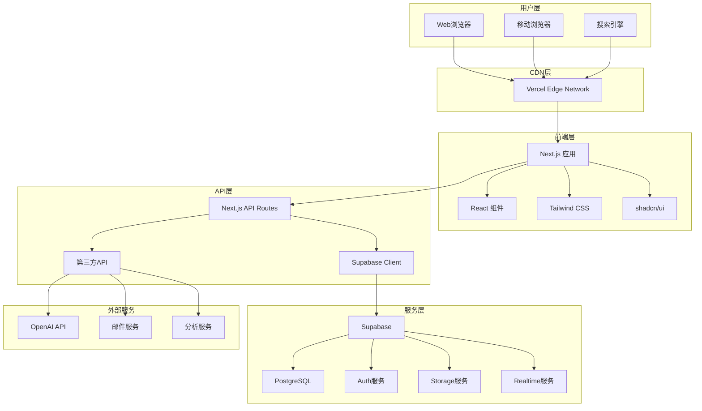
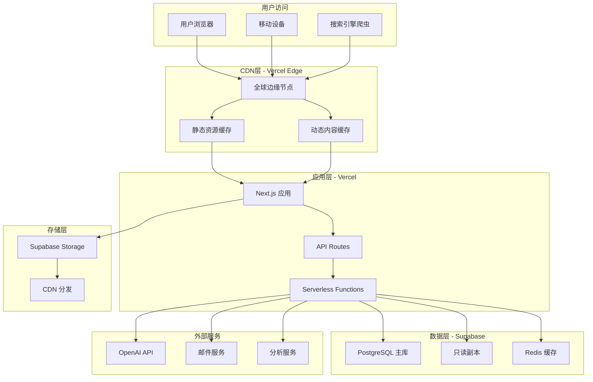

# Planckbaka 个人博客平台 - 技术架构设计文档

## 文档信息

| 项目名称 | Planckbaka 个人博客平台 |
|---------|------------------------|
| 文档版本 | v1.0 |
| 创建日期 | 2024-01-15 |
| 更新日期 | 2024-01-15 |
| 架构师 | Aki Wayne |
| 技术团队 | Frontend & Backend Team |
| 文档状态 | 已完成 |

## 1. 架构概述

### 1.1 架构目标

- **高性能**: 首屏加载时间 < 2秒，Lighthouse 评分 > 90
- **高可用**: 系统可用性 99.9%+，支持水平扩展
- **安全性**: 数据加密传输，用户隐私保护，防范常见攻击
- **可维护**: 模块化设计，代码规范，文档完善
- **用户体验**: 响应式设计，无障碍访问，流畅交互

### 1.2 技术选型原则

1. **现代化优先**: 选择最新稳定版本的技术栈
2. **生态完善**: 优先选择社区活跃、文档完善的技术
3. **性能导向**: 注重运行时性能和开发效率
4. **类型安全**: 全面采用 TypeScript 确保类型安全
5. **开发体验**: 优化开发工具链和调试体验

### 1.3 整体架构图



## 2. 技术栈详述

### 2.1 前端技术栈

#### 核心框架

**Next.js 15.5.0**
- **选择理由**: 
  - 全栈 React 框架，支持 SSR/SSG/ISR
  - App Router 支持 React Server Components
  - 内置性能优化和 SEO 支持
  - Vercel 原生支持，部署简单

- **配置示例**:
```typescript
// next.config.ts
import type { NextConfig } from 'next'

const nextConfig: NextConfig = {
  experimental: {
    turbo: {
      rules: {
        '*.svg': {
          loaders: ['@svgr/webpack'],
          as: '*.js',
        },
      },
    },
  },
  images: {
    domains: ['supabase.co', 'your-domain.com'],
    formats: ['image/webp', 'image/avif'],
  },
  async headers() {
    return [
      {
        source: '/(.*)',
        headers: [
          {
            key: 'X-Frame-Options',
            value: 'DENY',
          },
          {
            key: 'X-Content-Type-Options',
            value: 'nosniff',
          },
          {
            key: 'Referrer-Policy',
            value: 'origin-when-cross-origin',
          },
        ],
      },
    ]
  },
}

export default nextConfig
```

**React 19.1.0**
- **新特性应用**:
  - React Server Components
  - Concurrent Features
  - Automatic Batching
  - Suspense 改进

**TypeScript 5.x**
- **配置优化**:
```json
{
  "compilerOptions": {
    "target": "ES2022",
    "lib": ["dom", "dom.iterable", "es6"],
    "allowJs": true,
    "skipLibCheck": true,
    "strict": true,
    "noEmit": true,
    "esModuleInterop": true,
    "module": "esnext",
    "moduleResolution": "bundler",
    "resolveJsonModule": true,
    "isolatedModules": true,
    "jsx": "preserve",
    "incremental": true,
    "plugins": [
      {
        "name": "next"
      }
    ],
    "baseUrl": ".",
    "paths": {
      "@/*": ["./src/*"]
    }
  },
  "include": ["next-env.d.ts", "**/*.ts", "**/*.tsx", ".next/types/**/*.ts"],
  "exclude": ["node_modules"]
}
```

#### 样式和UI

**Tailwind CSS 4.1.12**
- **优势**:
  - 原子化 CSS，构建体积小
  - 设计系统一致性
  - 开发效率高
  - 响应式设计友好

- **配置**:
```javascript
// postcss.config.mjs
const config = {
  plugins: ["@tailwindcss/postcss"],
};

export default config;
```

**shadcn/ui + Radix UI**
- **组件架构**:
```typescript
// components/ui/button.tsx
import * as React from "react"
import { Slot } from "@radix-ui/react-slot"
import { cva, type VariantProps } from "class-variance-authority"
import { cn } from "@/lib/utils"

const buttonVariants = cva(
  "inline-flex items-center justify-center gap-2 whitespace-nowrap rounded-md text-sm font-medium transition-colors focus-visible:outline-none focus-visible:ring-2 focus-visible:ring-ring focus-visible:ring-offset-2 disabled:pointer-events-none disabled:opacity-50 [&_svg]:pointer-events-none [&_svg]:size-4 [&_svg]:shrink-0",
  {
    variants: {
      variant: {
        default: "bg-primary text-primary-foreground hover:bg-primary/90",
        destructive: "bg-destructive text-destructive-foreground hover:bg-destructive/90",
        outline: "border border-input bg-background hover:bg-accent hover:text-accent-foreground",
        secondary: "bg-secondary text-secondary-foreground hover:bg-secondary/80",
        ghost: "hover:bg-accent hover:text-accent-foreground",
        link: "text-primary underline-offset-4 hover:underline",
      },
      size: {
        default: "h-10 px-4 py-2",
        sm: "h-9 rounded-md px-3",
        lg: "h-11 rounded-md px-8",
        icon: "h-10 w-10",
      },
    },
    defaultVariants: {
      variant: "default",
      size: "default",
    },
  }
)

export interface ButtonProps
  extends React.ButtonHTMLAttributes<HTMLButtonElement>,
    VariantProps<typeof buttonVariants> {
  asChild?: boolean
}

const Button = React.forwardRef<HTMLButtonElement, ButtonProps>(
  ({ className, variant, size, asChild = false, ...props }, ref) => {
    const Comp = asChild ? Slot : "button"
    return (
      <Comp
        className={cn(buttonVariants({ variant, size, className }))}
        ref={ref}
        {...props}
      />
    )
  }
)
Button.displayName = "Button"

export { Button, buttonVariants }
```

#### 状态管理和数据获取

**Zustand (轻量级状态管理)**
```typescript
// stores/authStore.ts
import { create } from 'zustand'
import { persist } from 'zustand/middleware'
import type { User } from '@supabase/supabase-js'

interface AuthState {
  user: User | null
  isLoading: boolean
  setUser: (user: User | null) => void
  setLoading: (loading: boolean) => void
  logout: () => void
}

export const useAuthStore = create<AuthState>()(n  persist(
    (set) => ({
      user: null,
      isLoading: true,
      setUser: (user) => set({ user }),
      setLoading: (isLoading) => set({ isLoading }),
      logout: () => set({ user: null }),
    }),
    {
      name: 'auth-storage',
      partialize: (state) => ({ user: state.user }),
    }
  )
)
```

**TanStack Query (数据获取和缓存)**
```typescript
// hooks/usePosts.ts
import { useQuery, useMutation, useQueryClient } from '@tanstack/react-query'
import { getPosts, createPost, updatePost, deletePost } from '@/lib/api/posts'
import type { Post, CreatePostData, UpdatePostData } from '@/types/post'

export function usePosts(filters?: PostFilters) {
  return useQuery({
    queryKey: ['posts', filters],
    queryFn: () => getPosts(filters),
    staleTime: 5 * 60 * 1000, // 5 minutes
  })
}

export function useCreatePost() {
  const queryClient = useQueryClient()
  
  return useMutation({
    mutationFn: createPost,
    onSuccess: () => {
      queryClient.invalidateQueries({ queryKey: ['posts'] })
    },
  })
}
```

#### 动画和交互

**Framer Motion**
```typescript
// components/AnimatedCard.tsx
import { motion } from 'framer-motion'
import { Card } from '@/components/ui/card'

interface AnimatedCardProps {
  children: React.ReactNode
  delay?: number
}

export function AnimatedCard({ children, delay = 0 }: AnimatedCardProps) {
  return (
    <motion.div
      initial={{ opacity: 0, y: 20 }}
      animate={{ opacity: 1, y: 0 }}
      transition={{ duration: 0.5, delay }}
      whileHover={{ y: -5 }}
      whileTap={{ scale: 0.98 }}
    >
      <Card>{children}</Card>
    </motion.div>
  )
}
```

**GSAP (复杂动画)**
```typescript
// hooks/useScrollAnimation.ts
import { useEffect, useRef } from 'react'
import { gsap } from 'gsap'
import { ScrollTrigger } from 'gsap/ScrollTrigger'

gsap.registerPlugin(ScrollTrigger)

export function useScrollAnimation() {
  const ref = useRef<HTMLDivElement>(null)
  
  useEffect(() => {
    const element = ref.current
    if (!element) return
    
    gsap.fromTo(
      element,
      { opacity: 0, y: 50 },
      {
        opacity: 1,
        y: 0,
        duration: 1,
        scrollTrigger: {
          trigger: element,
          start: 'top 80%',
          end: 'bottom 20%',
          toggleActions: 'play none none reverse',
        },
      }
    )
    
    return () => {
      ScrollTrigger.getAll().forEach(trigger => trigger.kill())
    }
  }, [])
  
  return ref
}
```

### 2.2 后端技术栈

#### Supabase BaaS 架构

**核心服务**

1. **数据库服务 (PostgreSQL)**
```sql
-- 数据库架构设计

-- 用户配置表
CREATE TABLE profiles (
  id UUID REFERENCES auth.users(id) PRIMARY KEY,
  username TEXT UNIQUE,
  full_name TEXT,
  avatar_url TEXT,
  bio TEXT,
  website TEXT,
  location TEXT,
  social_links JSONB DEFAULT '{}',
  settings JSONB DEFAULT '{}',
  created_at TIMESTAMP WITH TIME ZONE DEFAULT NOW(),
  updated_at TIMESTAMP WITH TIME ZONE DEFAULT NOW()
);

-- 博客文章表
CREATE TABLE posts (
  id UUID DEFAULT gen_random_uuid() PRIMARY KEY,
  title TEXT NOT NULL,
  slug TEXT UNIQUE NOT NULL,
  content TEXT,
  excerpt TEXT,
  featured_image TEXT,
  meta_title TEXT,
  meta_description TEXT,
  published BOOLEAN DEFAULT FALSE,
  featured BOOLEAN DEFAULT FALSE,
  view_count INTEGER DEFAULT 0,
  like_count INTEGER DEFAULT 0,
  author_id UUID REFERENCES profiles(id) NOT NULL,
  published_at TIMESTAMP WITH TIME ZONE,
  created_at TIMESTAMP WITH TIME ZONE DEFAULT NOW(),
  updated_at TIMESTAMP WITH TIME ZONE DEFAULT NOW()
);

-- 分类表
CREATE TABLE categories (
  id UUID DEFAULT gen_random_uuid() PRIMARY KEY,
  name TEXT NOT NULL,
  slug TEXT UNIQUE NOT NULL,
  description TEXT,
  color TEXT DEFAULT '#3b82f6',
  icon TEXT,
  sort_order INTEGER DEFAULT 0,
  created_at TIMESTAMP WITH TIME ZONE DEFAULT NOW()
);

-- 标签表
CREATE TABLE tags (
  id UUID DEFAULT gen_random_uuid() PRIMARY KEY,
  name TEXT NOT NULL UNIQUE,
  slug TEXT UNIQUE NOT NULL,
  description TEXT,
  color TEXT DEFAULT '#6b7280',
  usage_count INTEGER DEFAULT 0,
  created_at TIMESTAMP WITH TIME ZONE DEFAULT NOW()
);

-- 文章分类关联表
CREATE TABLE post_categories (
  post_id UUID REFERENCES posts(id) ON DELETE CASCADE,
  category_id UUID REFERENCES categories(id) ON DELETE CASCADE,
  PRIMARY KEY (post_id, category_id)
);

-- 文章标签关联表
CREATE TABLE post_tags (
  post_id UUID REFERENCES posts(id) ON DELETE CASCADE,
  tag_id UUID REFERENCES tags(id) ON DELETE CASCADE,
  PRIMARY KEY (post_id, tag_id)
);

-- 评论表
CREATE TABLE comments (
  id UUID DEFAULT gen_random_uuid() PRIMARY KEY,
  content TEXT NOT NULL,
  post_id UUID REFERENCES posts(id) ON DELETE CASCADE,
  author_id UUID REFERENCES profiles(id),
  parent_id UUID REFERENCES comments(id),
  status TEXT DEFAULT 'pending' CHECK (status IN ('pending', 'approved', 'rejected')),
  like_count INTEGER DEFAULT 0,
  created_at TIMESTAMP WITH TIME ZONE DEFAULT NOW(),
  updated_at TIMESTAMP WITH TIME ZONE DEFAULT NOW()
);

-- 用户互动表
CREATE TABLE user_interactions (
  id UUID DEFAULT gen_random_uuid() PRIMARY KEY,
  user_id UUID REFERENCES profiles(id),
  target_type TEXT NOT NULL CHECK (target_type IN ('post', 'comment')),
  target_id UUID NOT NULL,
  interaction_type TEXT NOT NULL CHECK (interaction_type IN ('like', 'bookmark', 'share')),
  created_at TIMESTAMP WITH TIME ZONE DEFAULT NOW(),
  UNIQUE(user_id, target_type, target_id, interaction_type)
);

-- 订阅表
CREATE TABLE subscriptions (
  id UUID DEFAULT gen_random_uuid() PRIMARY KEY,
  email TEXT NOT NULL,
  status TEXT DEFAULT 'active' CHECK (status IN ('active', 'unsubscribed')),
  subscription_type TEXT DEFAULT 'newsletter' CHECK (subscription_type IN ('newsletter', 'comments')),
  created_at TIMESTAMP WITH TIME ZONE DEFAULT NOW(),
  UNIQUE(email, subscription_type)
);
```

2. **行级安全策略 (RLS)**
```sql
-- 启用 RLS
ALTER TABLE profiles ENABLE ROW LEVEL SECURITY;
ALTER TABLE posts ENABLE ROW LEVEL SECURITY;
ALTER TABLE comments ENABLE ROW LEVEL SECURITY;
ALTER TABLE user_interactions ENABLE ROW LEVEL SECURITY;

-- 用户配置策略
CREATE POLICY "Public profiles are viewable by everyone" ON profiles
  FOR SELECT USING (true);

CREATE POLICY "Users can insert their own profile" ON profiles
  FOR INSERT WITH CHECK (auth.uid() = id);

CREATE POLICY "Users can update own profile" ON profiles
  FOR UPDATE USING (auth.uid() = id);

-- 文章策略
CREATE POLICY "Published posts are viewable by everyone" ON posts
  FOR SELECT USING (published = true OR auth.uid() = author_id);

CREATE POLICY "Authors can insert their own posts" ON posts
  FOR INSERT WITH CHECK (auth.uid() = author_id);

CREATE POLICY "Authors can update their own posts" ON posts
  FOR UPDATE USING (auth.uid() = author_id);

CREATE POLICY "Authors can delete their own posts" ON posts
  FOR DELETE USING (auth.uid() = author_id);

-- 评论策略
CREATE POLICY "Approved comments are viewable by everyone" ON comments
  FOR SELECT USING (status = 'approved' OR auth.uid() = author_id);

CREATE POLICY "Authenticated users can insert comments" ON comments
  FOR INSERT WITH CHECK (auth.role() = 'authenticated');

CREATE POLICY "Users can update their own comments" ON comments
  FOR UPDATE USING (auth.uid() = author_id);

CREATE POLICY "Users can delete their own comments" ON comments
  FOR DELETE USING (auth.uid() = author_id);
```

3. **数据库函数和触发器**
```sql
-- 更新时间戳函数
CREATE OR REPLACE FUNCTION update_updated_at_column()
RETURNS TRIGGER AS $$
BEGIN
  NEW.updated_at = NOW();
  RETURN NEW;
END;
$$ language 'plpgsql';

-- 创建触发器
CREATE TRIGGER update_profiles_updated_at
  BEFORE UPDATE ON profiles
  FOR EACH ROW
  EXECUTE FUNCTION update_updated_at_column();

CREATE TRIGGER update_posts_updated_at
  BEFORE UPDATE ON posts
  FOR EACH ROW
  EXECUTE FUNCTION update_updated_at_column();

-- 自动创建用户配置
CREATE OR REPLACE FUNCTION public.handle_new_user()
RETURNS TRIGGER AS $$
BEGIN
  INSERT INTO public.profiles (id, full_name, avatar_url)
  VALUES (
    new.id,
    new.raw_user_meta_data->>'full_name',
    new.raw_user_meta_data->>'avatar_url'
  );
  RETURN new;
END;
$$ LANGUAGE plpgsql SECURITY DEFINER;

CREATE TRIGGER on_auth_user_created
  AFTER INSERT ON auth.users
  FOR EACH ROW EXECUTE FUNCTION public.handle_new_user();

-- 更新文章浏览量
CREATE OR REPLACE FUNCTION increment_post_view_count(post_id UUID)
RETURNS void AS $$
BEGIN
  UPDATE posts 
  SET view_count = view_count + 1 
  WHERE id = post_id;
END;
$$ LANGUAGE plpgsql SECURITY DEFINER;

-- 更新标签使用次数
CREATE OR REPLACE FUNCTION update_tag_usage_count()
RETURNS TRIGGER AS $$
BEGIN
  IF TG_OP = 'INSERT' THEN
    UPDATE tags SET usage_count = usage_count + 1 WHERE id = NEW.tag_id;
    RETURN NEW;
  ELSIF TG_OP = 'DELETE' THEN
    UPDATE tags SET usage_count = usage_count - 1 WHERE id = OLD.tag_id;
    RETURN OLD;
  END IF;
  RETURN NULL;
END;
$$ LANGUAGE plpgsql;

CREATE TRIGGER update_tag_usage_count_trigger
  AFTER INSERT OR DELETE ON post_tags
  FOR EACH ROW
  EXECUTE FUNCTION update_tag_usage_count();
```

4. **认证配置**
```typescript
// lib/supabase/auth.ts
import { createClientComponentClient } from '@supabase/auth-helpers-nextjs'
import type { Database } from '@/types/supabase'

export const supabase = createClientComponentClient<Database>()

// 认证配置
export const authConfig = {
  providers: {
    google: {
      enabled: true,
      clientId: process.env.GOOGLE_CLIENT_ID!,
      clientSecret: process.env.GOOGLE_CLIENT_SECRET!,
    },
    github: {
      enabled: true,
      clientId: process.env.GITHUB_CLIENT_ID!,
      clientSecret: process.env.GITHUB_CLIENT_SECRET!,
    },
  },
  jwt: {
    expiryLimit: 3600, // 1 hour
    secret: process.env.SUPABASE_JWT_SECRET!,
  },
  email: {
    confirmSignUp: true,
    resetPassword: true,
    magicLink: true,
  },
}

// 认证辅助函数
export async function signInWithEmail(email: string, password: string) {
  const { data, error } = await supabase.auth.signInWithPassword({
    email,
    password,
  })
  
  if (error) throw error
  return data
}

export async function signUpWithEmail(email: string, password: string, metadata?: any) {
  const { data, error } = await supabase.auth.signUp({
    email,
    password,
    options: {
      data: metadata,
    },
  })
  
  if (error) throw error
  return data
}

export async function signInWithProvider(provider: 'google' | 'github') {
  const { data, error } = await supabase.auth.signInWithOAuth({
    provider,
    options: {
      redirectTo: `${window.location.origin}/auth/callback`,
    },
  })
  
  if (error) throw error
  return data
}
```

5. **存储配置**
```sql
-- 创建存储桶
INSERT INTO storage.buckets (id, name, public, file_size_limit, allowed_mime_types)
VALUES 
  ('avatars', 'avatars', true, 5242880, ARRAY['image/jpeg', 'image/png', 'image/webp']),
  ('post-images', 'post-images', true, 10485760, ARRAY['image/jpeg', 'image/png', 'image/webp', 'image/gif']),
  ('documents', 'documents', false, 52428800, ARRAY['application/pdf', 'text/plain', 'application/msword']);

-- 存储策略
CREATE POLICY "Avatar images are publicly accessible" ON storage.objects
  FOR SELECT USING (bucket_id = 'avatars');

CREATE POLICY "Anyone can upload an avatar" ON storage.objects
  FOR INSERT WITH CHECK (
    bucket_id = 'avatars' AND 
    auth.role() = 'authenticated' AND
    (storage.foldername(name))[1] = auth.uid()::text
  );

CREATE POLICY "Users can update their own avatar" ON storage.objects
  FOR UPDATE USING (
    bucket_id = 'avatars' AND 
    auth.uid()::text = (storage.foldername(name))[1]
  );

CREATE POLICY "Post images are publicly accessible" ON storage.objects
  FOR SELECT USING (bucket_id = 'post-images');

CREATE POLICY "Authenticated users can upload post images" ON storage.objects
  FOR INSERT WITH CHECK (
    bucket_id = 'post-images' AND 
    auth.role() = 'authenticated'
  );
```

### 2.3 API 设计

#### RESTful API 规范

**API 路由结构**
```
/api/
├── auth/
│   ├── login          # POST - 用户登录
│   ├── register       # POST - 用户注册
│   ├── logout         # POST - 用户登出
│   ├── refresh        # POST - 刷新令牌
│   └── callback       # GET - OAuth 回调
├── posts/
│   ├── /              # GET - 获取文章列表, POST - 创建文章
│   ├── [id]/          # GET - 获取文章详情, PUT - 更新文章, DELETE - 删除文章
│   ├── [id]/like      # POST - 点赞文章
│   ├── [id]/view      # POST - 增加浏览量
│   └── search         # GET - 搜索文章
├── comments/
│   ├── /              # GET - 获取评论列表, POST - 创建评论
│   ├── [id]/          # PUT - 更新评论, DELETE - 删除评论
│   └── [id]/like      # POST - 点赞评论
├── categories/
│   ├── /              # GET - 获取分类列表, POST - 创建分类
│   └── [id]/          # GET - 获取分类详情, PUT - 更新分类, DELETE - 删除分类
├── tags/
│   ├── /              # GET - 获取标签列表, POST - 创建标签
│   └── [id]/          # GET - 获取标签详情, PUT - 更新标签, DELETE - 删除标签
├── users/
│   ├── profile        # GET - 获取用户资料, PUT - 更新用户资料
│   ├── posts          # GET - 获取用户文章
│   └── stats          # GET - 获取用户统计
├── upload/
│   ├── image          # POST - 上传图片
│   └── file           # POST - 上传文件
└── analytics/
    ├── posts          # GET - 文章分析数据
    ├── traffic        # GET - 流量分析数据
    └── engagement     # GET - 用户互动数据
```

**API 实现示例**
```typescript
// app/api/posts/route.ts
import { NextRequest, NextResponse } from 'next/server'
import { createRouteHandlerClient } from '@supabase/auth-helpers-nextjs'
import { cookies } from 'next/headers'
import { z } from 'zod'
import type { Database } from '@/types/supabase'

const createPostSchema = z.object({
  title: z.string().min(1).max(200),
  content: z.string().min(1),
  excerpt: z.string().max(500).optional(),
  featured_image: z.string().url().optional(),
  published: z.boolean().default(false),
  category_ids: z.array(z.string().uuid()).optional(),
  tag_ids: z.array(z.string().uuid()).optional(),
})

// GET /api/posts - 获取文章列表
export async function GET(request: NextRequest) {
  const supabase = createRouteHandlerClient<Database>({ cookies })
  const { searchParams } = new URL(request.url)
  
  const page = parseInt(searchParams.get('page') || '1')
  const limit = parseInt(searchParams.get('limit') || '10')
  const category = searchParams.get('category')
  const tag = searchParams.get('tag')
  const search = searchParams.get('search')
  
  try {
    let query = supabase
      .from('posts')
      .select(`
        *,
        profiles:author_id (
          username,
          full_name,
          avatar_url
        ),
        post_categories (
          categories (
            id,
            name,
            slug,
            color
          )
        ),
        post_tags (
          tags (
            id,
            name,
            slug
          )
        )
      `)
      .eq('published', true)
      .order('created_at', { ascending: false })
      .range((page - 1) * limit, page * limit - 1)
    
    // 添加过滤条件
    if (category) {
      query = query.contains('post_categories.categories.slug', [category])
    }
    
    if (tag) {
      query = query.contains('post_tags.tags.slug', [tag])
    }
    
    if (search) {
      query = query.or(`title.ilike.%${search}%,content.ilike.%${search}%`)
    }
    
    const { data: posts, error, count } = await query
    
    if (error) {
      return NextResponse.json(
        { error: 'Failed to fetch posts' },
        { status: 500 }
      )
    }
    
    return NextResponse.json({
      posts,
      pagination: {
        page,
        limit,
        total: count || 0,
        hasMore: (count || 0) > page * limit,
      },
    })
  } catch (error) {
    console.error('Error fetching posts:', error)
    return NextResponse.json(
      { error: 'Internal server error' },
      { status: 500 }
    )
  }
}

// POST /api/posts - 创建文章
export async function POST(request: NextRequest) {
  const supabase = createRouteHandlerClient<Database>({ cookies })
  
  try {
    // 验证用户认证
    const { data: { user }, error: authError } = await supabase.auth.getUser()
    
    if (authError || !user) {
      return NextResponse.json(
        { error: 'Unauthorized' },
        { status: 401 }
      )
    }
    
    // 验证请求数据
    const body = await request.json()
    const validatedData = createPostSchema.parse(body)
    
    // 生成 slug
    const slug = generateSlug(validatedData.title)
    
    // 创建文章
    const { data: post, error } = await supabase
      .from('posts')
      .insert({
        ...validatedData,
        slug,
        author_id: user.id,
        published_at: validatedData.published ? new Date().toISOString() : null,
      })
      .select()
      .single()
    
    if (error) {
      return NextResponse.json(
        { error: 'Failed to create post' },
        { status: 500 }
      )
    }
    
    // 关联分类和标签
    if (validatedData.category_ids?.length) {
      await supabase
        .from('post_categories')
        .insert(
          validatedData.category_ids.map(categoryId => ({
            post_id: post.id,
            category_id: categoryId,
          }))
        )
    }
    
    if (validatedData.tag_ids?.length) {
      await supabase
        .from('post_tags')
        .insert(
          validatedData.tag_ids.map(tagId => ({
            post_id: post.id,
            tag_id: tagId,
          }))
        )
    }
    
    return NextResponse.json(post, { status: 201 })
  } catch (error) {
    if (error instanceof z.ZodError) {
      return NextResponse.json(
        { error: 'Invalid request data', details: error.errors },
        { status: 400 }
      )
    }
    
    console.error('Error creating post:', error)
    return NextResponse.json(
      { error: 'Internal server error' },
      { status: 500 }
    )
  }
}

// 辅助函数
function generateSlug(title: string): string {
  return title
    .toLowerCase()
    .replace(/[^a-z0-9\s-]/g, '')
    .replace(/\s+/g, '-')
    .replace(/-+/g, '-')
    .trim()
    .substring(0, 100)
}
```

### 2.4 实时功能

**Supabase Realtime 集成**
```typescript
// hooks/useRealtimeSubscription.ts
import { useEffect, useState } from 'react'
import { createClientComponentClient } from '@supabase/auth-helpers-nextjs'
import type { Database } from '@/types/supabase'

type Tables = Database['public']['Tables']
type Post = Tables['posts']['Row']
type Comment = Tables['comments']['Row']

export function useRealtimePosts() {
  const [posts, setPosts] = useState<Post[]>([])
  const supabase = createClientComponentClient<Database>()
  
  useEffect(() => {
    // 初始数据加载
    const fetchPosts = async () => {
      const { data } = await supabase
        .from('posts')
        .select('*')
        .eq('published', true)
        .order('created_at', { ascending: false })
      
      if (data) setPosts(data)
    }
    
    fetchPosts()
    
    // 设置实时订阅
    const channel = supabase
      .channel('posts-changes')
      .on(
        'postgres_changes',
        {
          event: '*',
          schema: 'public',
          table: 'posts',
          filter: 'published=eq.true',
        },
        (payload) => {
          console.log('Post change received:', payload)
          
          switch (payload.eventType) {
            case 'INSERT':
              setPosts(current => [payload.new as Post, ...current])
              break
            case 'UPDATE':
              setPosts(current =>
                current.map(post =>
                  post.id === payload.new.id ? (payload.new as Post) : post
                )
              )
              break
            case 'DELETE':
              setPosts(current =>
                current.filter(post => post.id !== payload.old.id)
              )
              break
          }
        }
      )
      .subscribe()
    
    return () => {
      supabase.removeChannel(channel)
    }
  }, [])
  
  return posts
}

// 实时评论订阅
export function useRealtimeComments(postId: string) {
  const [comments, setComments] = useState<Comment[]>([])
  const supabase = createClientComponentClient<Database>()
  
  useEffect(() => {
    if (!postId) return
    
    // 初始数据加载
    const fetchComments = async () => {
      const { data } = await supabase
        .from('comments')
        .select(`
          *,
          profiles:author_id (
            username,
            full_name,
            avatar_url
          )
        `)
        .eq('post_id', postId)
        .eq('status', 'approved')
        .order('created_at', { ascending: true })
      
      if (data) setComments(data)
    }
    
    fetchComments()
    
    // 设置实时订阅
    const channel = supabase
      .channel(`comments-${postId}`)
      .on(
        'postgres_changes',
        {
          event: '*',
          schema: 'public',
          table: 'comments',
          filter: `post_id=eq.${postId}`,
        },
        (payload) => {
          if (payload.new && (payload.new as Comment).status !== 'approved') {
            return // 只显示已审核的评论
          }
          
          switch (payload.eventType) {
            case 'INSERT':
              setComments(current => [...current, payload.new as Comment])
              break
            case 'UPDATE':
              setComments(current =>
                current.map(comment =>
                  comment.id === payload.new.id ? (payload.new as Comment) : comment
                )
              )
              break
            case 'DELETE':
              setComments(current =>
                current.filter(comment => comment.id !== payload.old.id)
              )
              break
          }
        }
      )
      .subscribe()
    
    return () => {
      supabase.removeChannel(channel)
    }
  }, [postId])
  
  return comments
}
```

## 3. 部署架构

### 3.1 部署环境

**生产环境架构**


### 3.2 环境配置

**环境变量管理**
```bash
# .env.local (开发环境)
NEXT_PUBLIC_SITE_URL=http://localhost:3000
NEXT_PUBLIC_SUPABASE_URL=https://your-project.supabase.co
NEXT_PUBLIC_SUPABASE_ANON_KEY=your-anon-key
SUPABASE_SERVICE_ROLE_KEY=your-service-role-key

# OpenAI
OPENAI_API_KEY=your-openai-api-key

# 邮件服务
RESEND_API_KEY=your-resend-api-key
FROM_EMAIL=noreply@yourdomain.com

# 分析服务
GOOGLE_ANALYTICS_ID=G-XXXXXXXXXX
VERCEL_ANALYTICS_ID=your-vercel-analytics-id

# OAuth
GOOGLE_CLIENT_ID=your-google-client-id
GOOGLE_CLIENT_SECRET=your-google-client-secret
GITHUB_CLIENT_ID=your-github-client-id
GITHUB_CLIENT_SECRET=your-github-client-secret

# 安全
NEXTAUTH_SECRET=your-nextauth-secret
NEXTAUTH_URL=http://localhost:3000
```

**Vercel 部署配置**
```json
// vercel.json
{
  "buildCommand": "npm run build",
  "outputDirectory": ".next",
  "framework": "nextjs",
  "functions": {
    "app/api/**/*.ts": {
      "maxDuration": 30
    }
  },
  "headers": [
    {
      "source": "/(.*)",
      "headers": [
        {
          "key": "X-Frame-Options",
          "value": "DENY"
        },
        {
          "key": "X-Content-Type-Options",
          "value": "nosniff"
        },
        {
          "key": "Referrer-Policy",
          "value": "origin-when-cross-origin"
        },
        {
          "key": "Permissions-Policy",
          "value": "camera=(), microphone=(), geolocation=()"
        }
      ]
    }
  ],
  "redirects": [
    {
      "source": "/admin",
      "destination": "/dashboard",
      "permanent": true
    }
  ],
  "rewrites": [
    {
      "source": "/sitemap.xml",
      "destination": "/api/sitemap"
    },
    {
      "source": "/robots.txt",
      "destination": "/api/robots"
    }
  ]
}
```

### 3.3 CI/CD 流程

**GitHub Actions 配置**
```yaml
# .github/workflows/ci.yml
name: CI/CD Pipeline

on:
  push:
    branches: [main, develop]
  pull_request:
    branches: [main]

jobs:
  test:
    runs-on: ubuntu-latest
    
    steps:
      - name: Checkout code
        uses: actions/checkout@v4
        
      - name: Setup Node.js
        uses: actions/setup-node@v4
        with:
          node-version: '18'
          cache: 'npm'
          
      - name: Install dependencies
        run: npm ci
        
      - name: Run type check
        run: npm run type-check
        
      - name: Run linting
        run: npm run lint
        
      - name: Run tests
        run: npm run test
        
      - name: Build application
        run: npm run build
        env:
          NEXT_PUBLIC_SUPABASE_URL: ${{ secrets.NEXT_PUBLIC_SUPABASE_URL }}
          NEXT_PUBLIC_SUPABASE_ANON_KEY: ${{ secrets.NEXT_PUBLIC_SUPABASE_ANON_KEY }}
          
  deploy:
    needs: test
    runs-on: ubuntu-latest
    if: github.ref == 'refs/heads/main'
    
    steps:
      - name: Deploy to Vercel
        uses: amondnet/vercel-action@v25
        with:
          vercel-token: ${{ secrets.VERCEL_TOKEN }}
          vercel-org-id: ${{ secrets.VERCEL_ORG_ID }}
          vercel-project-id: ${{ secrets.VERCEL_PROJECT_ID }}
          vercel-args: '--prod'
```

## 4. 性能优化

### 4.1 前端性能优化

**代码分割和懒加载**
```typescript
// 动态导入组件
const DynamicChart = dynamic(() => import('@/components/Chart'), {
  loading: () => <ChartSkeleton />,
  ssr: false,
})

const DynamicEditor = dynamic(() => import('@/components/Editor'), {
  loading: () => <EditorSkeleton />,
})

// 路由级别的代码分割
const DashboardPage = dynamic(() => import('@/app/dashboard/page'), {
  loading: () => <PageSkeleton />,
})
```

**图片优化**
```typescript
// components/OptimizedImage.tsx
import Image from 'next/image'
import { useState } from 'react'

interface OptimizedImageProps {
  src: string
  alt: string
  width: number
  height: number
  priority?: boolean
  className?: string
}

export function OptimizedImage({
  src,
  alt,
  width,
  height,
  priority = false,
  className,
}: OptimizedImageProps) {
  const [isLoading, setIsLoading] = useState(true)
  
  return (
    <div className={`relative overflow-hidden ${className}`}>
      <Image
        src={src}
        alt={alt}
        width={width}
        height={height}
        priority={priority}
        className={`transition-opacity duration-300 ${
          isLoading ? 'opacity-0' : 'opacity-100'
        }`}
        onLoad={() => setIsLoading(false)}
        sizes="(max-width: 768px) 100vw, (max-width: 1200px) 50vw, 33vw"
        placeholder="blur"
        blurDataURL="data:image/jpeg;base64,/9j/4AAQSkZJRgABAQAAAQABAAD/2wBDAAYEBQYFBAYGBQYHBwYIChAKCgkJChQODwwQFxQYGBcUFhYaHSUfGhsjHBYWICwgIyYnKSopGR8tMC0oMCUoKSj/2wBDAQcHBwoIChMKChMoGhYaKCgoKCgoKCgoKCgoKCgoKCgoKCgoKCgoKCgoKCgoKCgoKCgoKCgoKCgoKCgoKCgoKCj/wAARCAABAAEDASIAAhEBAxEB/8QAFQABAQAAAAAAAAAAAAAAAAAAAAv/xAAhEAACAQMDBQAAAAAAAAAAAAABAgMABAUGIWGRkqGx0f/EABUBAQEAAAAAAAAAAAAAAAAAAAMF/8QAGhEAAgIDAAAAAAAAAAAAAAAAAAECEgMRkf/aAAwDAQACEQMRAD8AltJagyeH0AthI5xdrLcNM91BF5pX2HaH9bcfaSXWGaRmknyJckliyjqTzSlT54b6bk+h0R//2Q=="
      />
      {isLoading && (
        <div className="absolute inset-0 bg-gray-200 animate-pulse" />
      )}
    </div>
  )
}
```

**缓存策略**
```typescript
// lib/cache.ts
import { unstable_cache } from 'next/cache'

// 缓存文章列表
export const getCachedPosts = unstable_cache(
  async (page: number, limit: number) => {
    const { data } = await supabase
      .from('posts')
      .select('*')
      .eq('published', true)
      .range((page - 1) * limit, page * limit - 1)
      .order('created_at', { ascending: false })
    
    return data
  },
  ['posts'],
  {
    revalidate: 300, // 5 minutes
    tags: ['posts'],
  }
)

// 缓存用户资料
export const getCachedProfile = unstable_cache(
  async (userId: string) => {
    const { data } = await supabase
      .from('profiles')
      .select('*')
      .eq('id', userId)
      .single()
    
    return data
  },
  ['profile'],
  {
    revalidate: 3600, // 1 hour
    tags: ['profile'],
  }
)
```

### 4.2 数据库性能优化

**索引优化**
```sql
-- 为常用查询创建索引
CREATE INDEX CONCURRENTLY idx_posts_published_created_at 
  ON posts(published, created_at DESC) 
  WHERE published = true;

CREATE INDEX CONCURRENTLY idx_posts_author_published 
  ON posts(author_id, published, created_at DESC);

CREATE INDEX CONCURRENTLY idx_posts_slug 
  ON posts(slug) 
  WHERE published = true;

CREATE INDEX CONCURRENTLY idx_comments_post_status 
  ON comments(post_id, status, created_at) 
  WHERE status = 'approved';

CREATE INDEX CONCURRENTLY idx_user_interactions_user_target 
  ON user_interactions(user_id, target_type, target_id);

-- 全文搜索索引
CREATE INDEX CONCURRENTLY idx_posts_search 
  ON posts USING gin(to_tsvector('english', title || ' ' || content)) 
  WHERE published = true;
```

**查询优化**
```sql
-- 优化的文章查询视图
CREATE VIEW post_list_view AS
SELECT 
  p.id,
  p.title,
  p.slug,
  p.excerpt,
  p.featured_image,
  p.view_count,
  p.like_count,
  p.created_at,
  p.published_at,
  pr.username,
  pr.full_name,
  pr.avatar_url,
  array_agg(DISTINCT c.name) as categories,
  array_agg(DISTINCT t.name) as tags
FROM posts p
JOIN profiles pr ON p.author_id = pr.id
LEFT JOIN post_categories pc ON p.id = pc.post_id
LEFT JOIN categories c ON pc.category_id = c.id
LEFT JOIN post_tags pt ON p.id = pt.post_id
LEFT JOIN tags t ON pt.tag_id = t.id
WHERE p.published = true
GROUP BY p.id, pr.id;

-- 分页查询函数
CREATE OR REPLACE FUNCTION get_posts_paginated(
  page_size INTEGER DEFAULT 10,
  page_offset INTEGER DEFAULT 0,
  category_filter TEXT DEFAULT NULL,
  tag_filter TEXT DEFAULT NULL,
  search_query TEXT DEFAULT NULL
)
RETURNS TABLE(
  id UUID,
  title TEXT,
  slug TEXT,
  excerpt TEXT,
  featured_image TEXT,
  view_count INTEGER,
  like_count INTEGER,
  created_at TIMESTAMPTZ,
  published_at TIMESTAMPTZ,
  username TEXT,
  full_name TEXT,
  avatar_url TEXT,
  categories TEXT[],
  tags TEXT[]
) AS $$
BEGIN
  RETURN QUERY
  SELECT *
  FROM post_list_view plv
  WHERE 
    (category_filter IS NULL OR category_filter = ANY(plv.categories))
    AND (tag_filter IS NULL OR tag_filter = ANY(plv.tags))
    AND (
      search_query IS NULL OR 
      plv.title ILIKE '%' || search_query || '%' OR
      plv.excerpt ILIKE '%' || search_query || '%'
    )
  ORDER BY plv.published_at DESC
  LIMIT page_size
  OFFSET page_offset;
END;
$$ LANGUAGE plpgsql;
```

### 4.3 监控和分析

**性能监控**
```typescript
// lib/monitoring.ts
import { Analytics } from '@vercel/analytics/react'
import { SpeedInsights } from '@vercel/speed-insights/next'

// 自定义性能监控
export function trackPerformance(name: string, duration: number) {
  if (typeof window !== 'undefined' && 'performance' in window) {
    // 发送到分析服务
    fetch('/api/analytics/performance', {
      method: 'POST',
      headers: { 'Content-Type': 'application/json' },
      body: JSON.stringify({
        name,
        duration,
        timestamp: Date.now(),
        url: window.location.href,
        userAgent: navigator.userAgent,
      }),
    }).catch(console.error)
  }
}

// 页面加载时间监控
export function usePageLoadTime() {
  useEffect(() => {
    const startTime = performance.now()
    
    const handleLoad = () => {
      const loadTime = performance.now() - startTime
      trackPerformance('page_load', loadTime)
    }
    
    if (document.readyState === 'complete') {
      handleLoad()
    } else {
      window.addEventListener('load', handleLoad)
      return () => window.removeEventListener('load', handleLoad)
    }
  }, [])
}

// 错误监控
export function setupErrorTracking() {
  if (typeof window !== 'undefined') {
    window.addEventListener('error', (event) => {
      fetch('/api/analytics/error', {
        method: 'POST',
        headers: { 'Content-Type': 'application/json' },
        body: JSON.stringify({
          message: event.error?.message || 'Unknown error',
          stack: event.error?.stack,
          filename: event.filename,
          lineno: event.lineno,
          colno: event.colno,
          timestamp: Date.now(),
          url: window.location.href,
        }),
      }).catch(console.error)
    })
    
    window.addEventListener('unhandledrejection', (event) => {
      fetch('/api/analytics/error', {
        method: 'POST',
        headers: { 'Content-Type': 'application/json' },
        body: JSON.stringify({
          message: event.reason?.message || 'Unhandled promise rejection',
          stack: event.reason?.stack,
          type: 'unhandledrejection',
          timestamp: Date.now(),
          url: window.location.href,
        }),
      }).catch(console.error)
    })
  }
}
```

## 5. 安全架构

### 5.1 认证和授权

**JWT 令牌管理**
```typescript
// lib/auth/jwt.ts
import jwt from 'jsonwebtoken'
import { cookies } from 'next/headers'

interface JWTPayload {
  userId: string
  email: string
  role: string
  iat: number
  exp: number
}

export function generateAccessToken(payload: Omit<JWTPayload, 'iat' | 'exp'>) {
  return jwt.sign(
    payload,
    process.env.JWT_SECRET!,
    { expiresIn: '15m' }
  )
}

export function generateRefreshToken(userId: string) {
  return jwt.sign(
    { userId, type: 'refresh' },
    process.env.JWT_REFRESH_SECRET!,
    { expiresIn: '7d' }
  )
}

export function verifyAccessToken(token: string): JWTPayload | null {
  try {
    return jwt.verify(token, process.env.JWT_SECRET!) as JWTPayload
  } catch (error) {
    return null
  }
}

export async function getAuthenticatedUser() {
  const cookieStore = cookies()
  const token = cookieStore.get('access_token')?.value
  
  if (!token) return null
  
  const payload = verifyAccessToken(token)
  return payload
}

// 中间件认证
export function withAuth(handler: Function) {
  return async (request: NextRequest) => {
    const token = request.headers.get('authorization')?.replace('Bearer ', '')
    
    if (!token) {
      return NextResponse.json(
        { error: 'Unauthorized' },
        { status: 401 }
      )
    }
    
    const payload = verifyAccessToken(token)
    if (!payload) {
      return NextResponse.json(
        { error: 'Invalid token' },
        { status: 401 }
      )
    }
    
    // 将用户信息添加到请求中
    request.user = payload
    return handler(request)
  }
}
```

### 5.2 数据安全

**数据加密**
```typescript
// lib/security/encryption.ts
import crypto from 'crypto'

const ALGORITHM = 'aes-256-gcm'
const SECRET_KEY = process.env.ENCRYPTION_SECRET!

export function encrypt(text: string): string {
  const iv = crypto.randomBytes(16)
  const cipher = crypto.createCipher(ALGORITHM, SECRET_KEY)
  cipher.setAAD(Buffer.from('additional-data'))
  
  let encrypted = cipher.update(text, 'utf8', 'hex')
  encrypted += cipher.final('hex')
  
  const authTag = cipher.getAuthTag()
  
  return `${iv.toString('hex')}:${authTag.toString('hex')}:${encrypted}`
}

export function decrypt(encryptedData: string): string {
  const [ivHex, authTagHex, encrypted] = encryptedData.split(':')
  
  const iv = Buffer.from(ivHex, 'hex')
  const authTag = Buffer.from(authTagHex, 'hex')
  
  const decipher = crypto.createDecipher(ALGORITHM, SECRET_KEY)
  decipher.setAAD(Buffer.from('additional-data'))
  decipher.setAuthTag(authTag)
  
  let decrypted = decipher.update(encrypted, 'hex', 'utf8')
  decrypted += decipher.final('utf8')
  
  return decrypted
}

// 密码哈希
export async function hashPassword(password: string): Promise<string> {
  const saltRounds = 12
  return await bcrypt.hash(password, saltRounds)
}

export async function verifyPassword(password: string, hash: string): Promise<boolean> {
  return await bcrypt.compare(password, hash)
}
```

**输入验证和清理**
```typescript
// lib/security/validation.ts
import { z } from 'zod'
import DOMPurify from 'isomorphic-dompurify'

// 通用验证模式
export const emailSchema = z.string().email().max(255)
export const passwordSchema = z.string().min(8).max(128)
export const usernameSchema = z.string().min(3).max(30).regex(/^[a-zA-Z0-9_]+$/)
export const slugSchema = z.string().min(1).max(100).regex(/^[a-z0-9-]+$/)

// 内容验证
export const postSchema = z.object({
  title: z.string().min(1).max(200),
  content: z.string().min(1).max(50000),
  excerpt: z.string().max(500).optional(),
  slug: slugSchema,
  published: z.boolean().default(false),
})

// HTML 内容清理
export function sanitizeHTML(html: string): string {
  return DOMPurify.sanitize(html, {
    ALLOWED_TAGS: [
      'p', 'br', 'strong', 'em', 'u', 's', 'h1', 'h2', 'h3', 'h4', 'h5', 'h6',
      'ul', 'ol', 'li', 'blockquote', 'code', 'pre', 'a', 'img'
    ],
    ALLOWED_ATTR: ['href', 'src', 'alt', 'title', 'class'],
    ALLOW_DATA_ATTR: false,
  })
}

// SQL 注入防护（通过参数化查询）
export function validateAndSanitizeInput<T>(schema: z.ZodSchema<T>, input: unknown): T {
  try {
    return schema.parse(input)
  } catch (error) {
    if (error instanceof z.ZodError) {
      throw new Error(`Validation failed: ${error.errors.map(e => e.message).join(', ')}`)
    }
    throw error
  }
}
```

### 5.3 API 安全

**速率限制**
```typescript
// lib/security/rateLimit.ts
import { NextRequest } from 'next/server'
import { Redis } from '@upstash/redis'

const redis = new Redis({
  url: process.env.UPSTASH_REDIS_REST_URL!,
  token: process.env.UPSTASH_REDIS_REST_TOKEN!,
})

interface RateLimitConfig {
  windowMs: number
  maxRequests: number
  keyGenerator?: (request: NextRequest) => string
}

export function createRateLimit(config: RateLimitConfig) {
  return async (request: NextRequest) => {
    const key = config.keyGenerator ? 
      config.keyGenerator(request) : 
      getClientIP(request)
    
    const redisKey = `rate_limit:${key}`
    const window = Math.floor(Date.now() / config.windowMs)
    const windowKey = `${redisKey}:${window}`
    
    const current = await redis.incr(windowKey)
    
    if (current === 1) {
      await redis.expire(windowKey, Math.ceil(config.windowMs / 1000))
    }
    
    if (current > config.maxRequests) {
      return {
        success: false,
        limit: config.maxRequests,
        remaining: 0,
        reset: (window + 1) * config.windowMs,
      }
    }
    
    return {
      success: true,
      limit: config.maxRequests,
      remaining: config.maxRequests - current,
      reset: (window + 1) * config.windowMs,
    }
  }
}

// 不同端点的速率限制配置
export const authRateLimit = createRateLimit({
  windowMs: 15 * 60 * 1000, // 15 minutes
  maxRequests: 5, // 5 attempts per window
})

export const apiRateLimit = createRateLimit({
  windowMs: 60 * 1000, // 1 minute
  maxRequests: 100, // 100 requests per minute
})

export const uploadRateLimit = createRateLimit({
  windowMs: 60 * 60 * 1000, // 1 hour
  maxRequests: 10, // 10 uploads per hour
})

function getClientIP(request: NextRequest): string {
  const forwarded = request.headers.get('x-forwarded-for')
  const realIP = request.headers.get('x-real-ip')
  
  if (forwarded) {
    return forwarded.split(',')[0].trim()
  }
  
  if (realIP) {
    return realIP
  }
  
  return 'unknown'
}
```

## 6. 测试策略

### 6.1 测试架构

**测试金字塔**
```
    /\     E2E Tests (10%)
   /  \    - Playwright
  /____\   - Critical user flows
 
  /______\  Integration Tests (20%)
 /        \ - API testing
/__________\- Database integration

/____________\ Unit Tests (70%)
              - Components
              - Utilities
              - Business logic
```

**测试配置**
```typescript
// jest.config.js
const nextJest = require('next/jest')

const createJestConfig = nextJest({
  dir: './',
})

const customJestConfig = {
  setupFilesAfterEnv: ['<rootDir>/jest.setup.js'],
  testEnvironment: 'jest-environment-jsdom',
  testPathIgnorePatterns: ['<rootDir>/.next/', '<rootDir>/node_modules/'],
  collectCoverageFrom: [
    'src/**/*.{js,jsx,ts,tsx}',
    '!src/**/*.d.ts',
    '!src/**/*.stories.{js,jsx,ts,tsx}',
  ],
  coverageThreshold: {
    global: {
      branches: 80,
      functions: 80,
      lines: 80,
      statements: 80,
    },
  },
  moduleNameMapping: {
    '^@/(.*)$': '<rootDir>/src/$1',
  },
}

module.exports = createJestConfig(customJestConfig)
```

### 6.2 单元测试

**组件测试**
```typescript
// __tests__/components/Button.test.tsx
import { render, screen, fireEvent } from '@testing-library/react'
import { Button } from '@/components/ui/button'

describe('Button Component', () => {
  it('renders with correct text', () => {
    render(<Button>Click me</Button>)
    expect(screen.getByText('Click me')).toBeInTheDocument()
  })
  
  it('handles click events', () => {
    const handleClick = jest.fn()
    render(<Button onClick={handleClick}>Click me</Button>)
    
    fireEvent.click(screen.getByText('Click me'))
    expect(handleClick).toHaveBeenCalledTimes(1)
  })
  
  it('applies variant styles correctly', () => {
    render(<Button variant="destructive">Delete</Button>)
    const button = screen.getByText('Delete')
    expect(button).toHaveClass('bg-destructive')
  })
  
  it('is disabled when loading', () => {
    render(<Button disabled>Loading...</Button>)
    const button = screen.getByText('Loading...')
    expect(button).toBeDisabled()
  })
})
```

**工具函数测试**
```typescript
// __tests__/lib/utils.test.ts
import { cn, formatDate, generateSlug } from '@/lib/utils'

describe('Utility Functions', () => {
  describe('cn', () => {
    it('merges class names correctly', () => {
      expect(cn('base', 'additional')).toBe('base additional')
    })
    
    it('handles conditional classes', () => {
      expect(cn('base', true && 'conditional')).toBe('base conditional')
      expect(cn('base', false && 'conditional')).toBe('base')
    })
  })
  
  describe('formatDate', () => {
    it('formats date correctly', () => {
      const date = new Date('2024-01-15T10:00:00Z')
      expect(formatDate(date)).toBe('January 15, 2024')
    })
  })
  
  describe('generateSlug', () => {
    it('generates slug from title', () => {
      expect(generateSlug('Hello World!')).toBe('hello-world')
      expect(generateSlug('React & Next.js Guide')).toBe('react-nextjs-guide')
    })
  })
})
```

### 6.3 集成测试

**API 测试**
```typescript
// __tests__/api/posts.test.ts
import { createMocks } from 'node-mocks-http'
import handler from '@/app/api/posts/route'
import { createClient } from '@supabase/supabase-js'

// Mock Supabase
jest.mock('@supabase/supabase-js')
const mockSupabase = createClient as jest.MockedFunction<typeof createClient>

describe('/api/posts', () => {
  beforeEach(() => {
    jest.clearAllMocks()
  })
  
  describe('GET', () => {
    it('returns posts successfully', async () => {
      const mockPosts = [
        {
          id: '1',
          title: 'Test Post',
          content: 'Test content',
          published: true,
        },
      ]
      
      mockSupabase.mockReturnValue({
        from: jest.fn().mockReturnValue({
          select: jest.fn().mockReturnValue({
            eq: jest.fn().mockReturnValue({
              order: jest.fn().mockReturnValue({
                range: jest.fn().mockResolvedValue({
                  data: mockPosts,
                  error: null,
                  count: 1,
                }),
              }),
            }),
          }),
        }),
      } as any)
      
      const { req, res } = createMocks({
        method: 'GET',
        query: { page: '1', limit: '10' },
      })
      
      await handler(req, res)
      
      expect(res._getStatusCode()).toBe(200)
      const data = JSON.parse(res._getData())
      expect(data.posts).toEqual(mockPosts)
    })
  })
  
  describe('POST', () => {
    it('creates post successfully', async () => {
      const newPost = {
        title: 'New Post',
        content: 'New content',
        published: false,
      }
      
      mockSupabase.mockReturnValue({
        auth: {
          getUser: jest.fn().mockResolvedValue({
            data: { user: { id: 'user-1' } },
            error: null,
          }),
        },
        from: jest.fn().mockReturnValue({
          insert: jest.fn().mockReturnValue({
            select: jest.fn().mockReturnValue({
              single: jest.fn().mockResolvedValue({
                data: { ...newPost, id: 'post-1' },
                error: null,
              }),
            }),
          }),
        }),
      } as any)
      
      const { req, res } = createMocks({
        method: 'POST',
        body: newPost,
      })
      
      await handler(req, res)
      
      expect(res._getStatusCode()).toBe(201)
    })
  })
})
```

### 6.4 E2E 测试

**Playwright 配置**
```typescript
// playwright.config.ts
import { defineConfig, devices } from '@playwright/test'

export default defineConfig({
  testDir: './e2e',
  fullyParallel: true,
  forbidOnly: !!process.env.CI,
  retries: process.env.CI ? 2 : 0,
  workers: process.env.CI ? 1 : undefined,
  reporter: 'html',
  use: {
    baseURL: 'http://localhost:3000',
    trace: 'on-first-retry',
    screenshot: 'only-on-failure',
  },
  projects: [
    {
      name: 'chromium',
      use: { ...devices['Desktop Chrome'] },
    },
    {
      name: 'firefox',
      use: { ...devices['Desktop Firefox'] },
    },
    {
      name: 'webkit',
      use: { ...devices['Desktop Safari'] },
    },
    {
      name: 'Mobile Chrome',
      use: { ...devices['Pixel 5'] },
    },
  ],
  webServer: {
    command: 'npm run dev',
    url: 'http://localhost:3000',
    reuseExistingServer: !process.env.CI,
  },
})
```

**E2E 测试用例**
```typescript
// e2e/blog.spec.ts
import { test, expect } from '@playwright/test'

test.describe('Blog functionality', () => {
  test('should display blog posts', async ({ page }) => {
    await page.goto('/')
    
    // 检查页面标题
    await expect(page).toHaveTitle(/Planckbaka Blog/)
    
    // 检查文章列表
    await expect(page.locator('[data-testid="post-list"]')).toBeVisible()
    
    // 检查至少有一篇文章
    const posts = page.locator('[data-testid="post-item"]')
    await expect(posts).toHaveCountGreaterThan(0)
  })
  
  test('should navigate to post detail', async ({ page }) => {
    await page.goto('/')
    
    // 点击第一篇文章
    const firstPost = page.locator('[data-testid="post-item"]').first()
    const postTitle = await firstPost.locator('h2').textContent()
    await firstPost.click()
    
    // 检查是否跳转到文章详情页
    await expect(page.locator('h1')).toHaveText(postTitle!)
    await expect(page.locator('[data-testid="post-content"]')).toBeVisible()
  })
  
  test('should allow user to comment', async ({ page }) => {
    // 先登录
    await page.goto('/login')
    await page.fill('[data-testid="email-input"]', 'test@example.com')
    await page.fill('[data-testid="password-input"]', 'password123')
    await page.click('[data-testid="login-button"]')
    
    // 访问文章页面
    await page.goto('/posts/test-post')
    
    // 添加评论
    await page.fill('[data-testid="comment-input"]', 'This is a test comment')
    await page.click('[data-testid="submit-comment"]')
    
    // 检查评论是否显示
    await expect(page.locator('[data-testid="comment-list"]')).toContainText('This is a test comment')
  })
})
```

## 7. 总结

### 7.1 架构优势

1. **现代化技术栈**: 采用最新的 Next.js 15、React 19、TypeScript 5 等技术
2. **高性能**: 通过 SSR/SSG、代码分割、图片优化等手段确保优异性能
3. **类型安全**: 全面使用 TypeScript，减少运行时错误
4. **可扩展性**: 模块化设计，支持水平扩展
5. **安全性**: 多层安全防护，数据加密，认证授权完善
6. **开发体验**: 优秀的开发工具链，热重载，类型提示

### 7.2 技术决策理由

1. **Next.js vs 其他框架**: 选择 Next.js 因其全栈能力、SEO 优化、性能优势
2. **Supabase vs 自建后端**: 选择 Supabase 因其开发效率、功能完整性、可扩展性
3. **Tailwind CSS vs 其他方案**: 选择 Tailwind 因其原子化、一致性、开发效率
4. **shadcn/ui vs 其他组件库**: 选择 shadcn/ui 因其可定制性、现代化设计、类型安全

### 7.3 未来扩展计划

1. **微服务架构**: 随着业务增长，可拆分为微服务架构
2. **多语言支持**: 国际化功能，支持多语言内容
3. **AI 功能增强**: 集成更多 AI 功能，如内容生成、智能推荐
4. **移动应用**: 开发 React Native 移动应用
5. **实时协作**: 支持多人实时编辑和协作功能

---

**文档维护**: 本文档将随着技术栈更新和架构演进持续更新  
**最后更新**: 2024-01-15  
**下次审查**: 2024-04-15